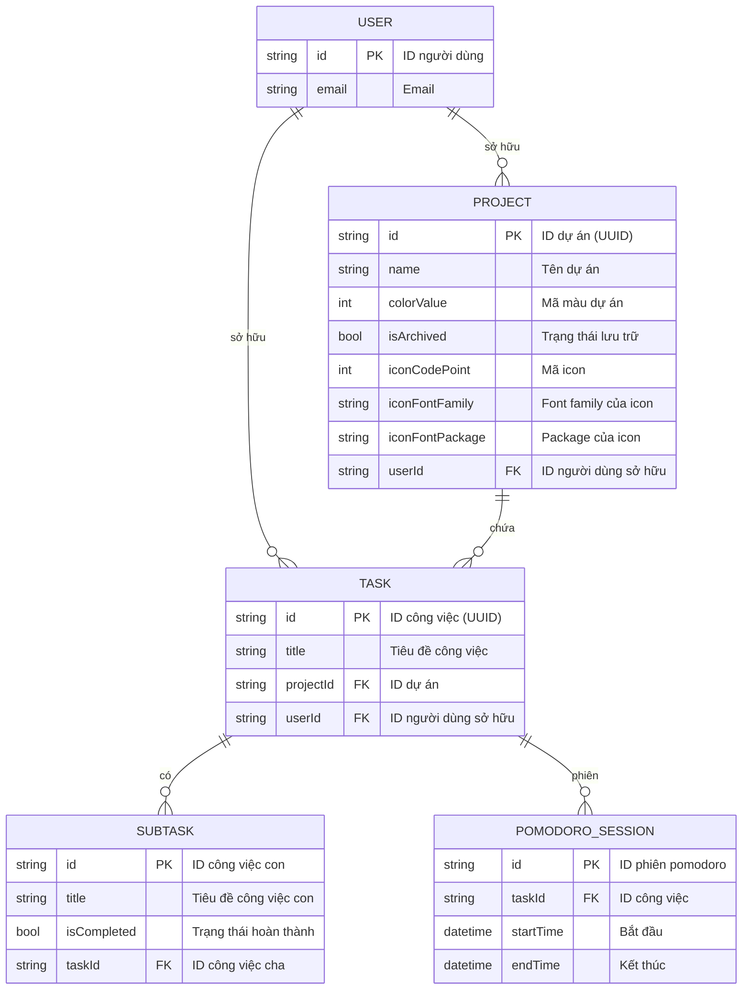

# Sơ đồ ERD - Ứng dụng ToDo Moji Focus

## Mô tả tổng quan
Sơ đồ ERD này mô tả cấu trúc cơ sở dữ liệu cho ứng dụng quản lý công việc Moji Focus, bao gồm các thực thể chính và mối quan hệ giữa chúng.

## Sơ đồ ERD

## Mô tả chi tiết các thực thể

### 1. USER (Người dùng)
- **Mục đích**: Lưu trữ thông tin người dùng hệ thống
- **Đặc điểm**: 
  - Sử dụng Firebase Authentication
  - Hỗ trợ đăng nhập bằng Google và Email/Password
  - Mỗi người dùng có dữ liệu riêng biệt

### 2. PROJECT (Dự án)
- **Mục đích**: Nhóm các công việc theo dự án
- **Đặc điểm**:
  - Có màu sắc và icon riêng để phân biệt
  - Có thể lưu trữ (archived)
  - Thuộc về một người dùng cụ thể

### 3. TASK (Công việc)
- **Mục đích**: Thực thể chính của ứng dụng
- **Đặc điểm**:
  - Tối giản: chỉ tiêu đề và liên kết đến dự án/người dùng
  - Có thể có công việc con (subtasks)

### 4. SUBTASK (Công việc con)
- **Mục đích**: Chia nhỏ công việc phức tạp
- **Đặc điểm**:
  - Thuộc về một công việc cha
  - Có trạng thái hoàn thành riêng

### 5. POMODORO_SESSION (Phiên Pomodoro)
- **Mục đích**: Theo dõi các phiên làm việc Pomodoro
- **Đặc điểm**:
  - Ghi lại thời gian bắt đầu và kết thúc cho mỗi task

 

## Mối quan hệ chính

1. **USER ↔ PROJECT**: Một người dùng có thể tạo nhiều dự án
2. **USER ↔ TASK**: Một người dùng có thể tạo nhiều công việc
3. **PROJECT ↔ TASK**: Một dự án chứa nhiều công việc
4. **TASK ↔ SUBTASK**: Một công việc có thể có nhiều công việc con
5. **TASK ↔ POMODORO_SESSION**: Một công việc có thể có nhiều phiên Pomodoro

## Lưu ý kỹ thuật

- **ID Generation**: Sử dụng UUID cho các thực thể chính (Task, Project, Tag)
- **Firebase Integration**: User sử dụng Firebase UID
- **Local Storage**: Sử dụng Hive cho lưu trữ local
- **Cloud Sync**: Sử dụng Cloud Firestore để đồng bộ dữ liệu
- **Archiving**: Hỗ trợ lưu trữ dữ liệu thay vì xóa hoàn toàn

### Ghi chú di trú dữ liệu (migration)

- Lược bỏ các thực thể phụ: `TAG`, `TASK_TAG`, `TASK_POMODORO_STATE`, `TASK_SCHEDULE`, `TASK_STATUS`, `TASK_AUDIT`, `NOTIFICATION`.
- `TASK` chỉ giữ: `id`, `title`, `projectId`, `userId`. Di chuyển hoặc loại bỏ các thuộc tính khác.
- `POMODORO_SESSION` giữ lại tối thiểu: `id`, `taskId`, `startTime`, `endTime`.

