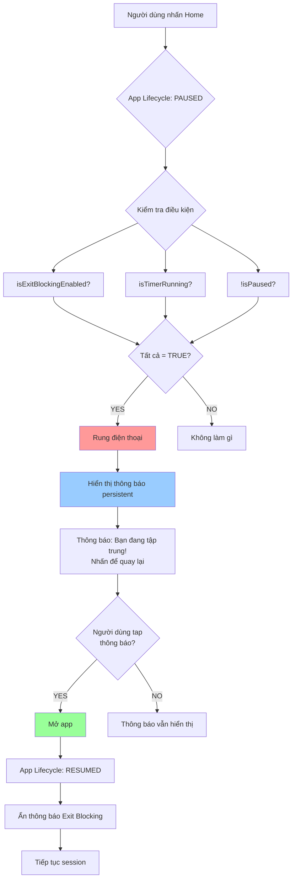

# Kế hoạch: Tính năng Exit Blocking với Thông báo và Rung điện thoại

## 📋 Tổng quan

Khi người dùng bật tính năng "Cấm thoát ứng dụng" (Exit Blocking) trong Strict Mode và đang có phiên tập trung đang chạy, nếu họ nhấn nút Home để minimize app, hệ thống sẽ:

1. **Phát hiện** app chuyển sang background (lifecycle paused)
2. **Hiển thị thông báo** persistent nhắc nhở quay lại app
3. **Rung điện thoại** để thu hút sự chú ý
4. **Cho phép** người dùng tap vào thông báo để quay lại app

## 🏗️ Phân tích Kiến trúc Hiện tại

### Các thành phần liên quan:

1. **Flutter Layer:**
   - [`HomeScreenStateManager`](lib/features/home/presentation/home_screen_state_manager.dart:80-97) - Đã có `handleAppLifecycleState()` để phát hiện app lifecycle
   - [`HomeScreen`](lib/features/home/presentation/home_screen.dart:22-48) - Implements `WidgetsBindingObserver` 
   - [`HomeCubit`](lib/features/home/domain/home_cubit.dart) - Quản lý state của Strict Mode
   - [`HomeState`](lib/features/home/domain/home_state.dart:17) - Có field `isExitBlockingEnabled`

2. **Service Layer:**
   - [`UnifiedNotificationService`](lib/core/services/unified_notification_service.dart) - Quản lý thông báo
   - Có sẵn notification IDs: `TIMER_NOTIFICATION_ID = 100`, `SESSION_END_NOTIFICATION_ID = 101`

3. **Native Layer:**
   - [`MainActivity.kt`](android/app/src/main/kotlin/MainActivity.kt) - Xử lý notification intents
   - Android Vibrator API - Cần thêm để rung điện thoại

### Điểm tích hợp:

✅ **HomeScreenStateManager.handleAppLifecycleState()** (line 80-97)
- Đã phát hiện khi app paused/resumed
- Cần thêm logic kiểm tra Exit Blocking ở đây

✅ **UnifiedNotificationService**
- Đã có infrastructure cho notifications
- Cần thêm method mới: `showExitBlockingNotification()`

## 🎯 Thiết kế Luồng Hoạt động (Flow)



## 📦 Các thành phần cần thay đổi/thêm mới

### 1. UnifiedNotificationService (lib/core/services/unified_notification_service.dart)

**Thêm mới:**
- Constant: `EXIT_BLOCKING_NOTIFICATION_ID = 102`
- Method: `showExitBlockingNotification()`
- Method: `cancelExitBlockingNotification()`

**Chi tiết implementation:**

```dart
static const int EXIT_BLOCKING_NOTIFICATION_ID = 102;

Future<void> showExitBlockingNotification() async {
  final androidDetails = AndroidNotificationDetails(
    'exit_blocking_channel',
    'Focus Mode Alert',
    channelDescription: 'Alert when you try to exit during focus session',
    importance: Importance.max,
    priority: Priority.high,
    ongoing: true, // Persistent notification
    autoCancel: false, // Không tự động ẩn
    sound: RawResourceAndroidNotificationSound('bell'),
    playSound: true,
    enableVibration: true,
    vibrationPattern: Int64List.fromList([0, 500, 200, 500]), // Rung 2 lần
    visibility: NotificationVisibility.public,
    category: AndroidNotificationCategory.alarm,
  );

  final details = NotificationDetails(android: androidDetails);

  await _notificationsPlugin.show(
    EXIT_BLOCKING_NOTIFICATION_ID,
    '🔒 Bạn đang trong phiên tập trung!',
    'Nhấn để quay lại ứng dụng và tiếp tục',
    details,
    payload: 'RETURN_TO_FOCUS',
  );
}

Future<void> cancelExitBlockingNotification() async {
  await _notificationsPlugin.cancel(EXIT_BLOCKING_NOTIFICATION_ID);
}
```

### 2. HomeScreenStateManager (lib/features/home/presentation/home_screen_state_manager.dart)

**Cập nhật method `handleAppLifecycleState()`:**

```dart
Future<void> handleAppLifecycleState(AppLifecycleState state) async {
  final homeCubit = context.read<HomeCubit>();
  final homeState = homeCubit.state;
  
  if (state == AppLifecycleState.paused) {
    print('App lifecycle: paused');
    
    // NEW: Kiểm tra Exit Blocking
    if (homeState.isExitBlockingEnabled && 
        homeState.isTimerRunning && 
        !homeState.isPaused) {
      
      print('Exit Blocking active - showing notification and vibrating');
      
      // Hiển thị thông báo
      await _notificationService.showExitBlockingNotification();
      
      // Rung điện thoại (sẽ được xử lý bởi notification vibration)
    }
    
  } else if (state == AppLifecycleState.resumed) {
    print('App lifecycle: resumed');
    
    // Ẩn thông báo Exit Blocking khi quay lại app
    await _notificationService.cancelExitBlockingNotification();
    
    // Restore timer state
    await _restoreTimerState();
    
    // Refresh permissions
    try {
      await homeCubit.refreshPermissionStates();
      print('Refreshed permission states after app resume.');
    } catch (e) {
      print('Error refreshing permission states: $e');
    }
  }
}
```

### 3. MainActivity.kt (android/app/src/main/kotlin/MainActivity.kt)

**Thêm notification channel mới trong `onCreate()`:**

```kotlin
// Exit Blocking Channel
val exitBlockingChannel = NotificationChannel(
    "exit_blocking_channel",
    "Focus Mode Alert",
    NotificationManager.IMPORTANCE_HIGH
).apply {
    description = "Alert when you try to exit during focus session"
    enableVibration(true)
    vibrationPattern = longArrayOf(0, 500, 200, 500) // Rung 2 lần
}
mgr.createNotificationChannel(exitBlockingChannel)
```

**Cập nhật `handleNotificationIntent()` để xử lý payload "RETURN_TO_FOCUS":**

```kotlin
when (flutterNotificationPayload) {
    "START_BREAK" -> {
        methodChannel?.invokeMethod("startBreak", null)
        Log.d("MainActivity", "Invoked startBreak on Flutter from notification tap.")
    }
    "START_WORK" -> {
        methodChannel?.invokeMethod("startWork", null)
        Log.d("MainActivity", "Invoked startWork on Flutter via handleNotificationIntent.")
    }
    "COMPLETED_ALL_SESSIONS" -> {
        methodChannel?.invokeMethod("completedAllSessions", null)
        Log.d("MainActivity", "Invoked completedAllSessions on Flutter via handleNotificationIntent.")
    }
    "RETURN_TO_FOCUS" -> {
        // Chỉ cần mở app, không cần invoke method đặc biệt
        // App sẽ tự động resume và ẩn notification
        Log.d("MainActivity", "User returned to focus session from exit blocking notification")
    }
    else -> {
        Log.d("MainActivity", "Generic notification tap, HomeCubit will restore state automatically.")
    }
}
```

### 4. UnifiedNotificationService init() - Xử lý notification tap

**Cập nhật `onDidReceiveNotificationResponse` trong `init()`:**

```dart
onDidReceiveNotificationResponse: (NotificationResponse response) async {
  print('Notification tapped: payload=${response.payload}');
  
  if (response.payload == 'RETURN_TO_FOCUS') {
    // Ẩn notification khi user tap
    await cancelExitBlockingNotification();
    
    // Gửi intent để mở app
    await _channel.invokeMethod('handleNotificationIntent', {
      'action': 'com.example.moji_todo.OPEN_APP',
      'fromNotification': true,
      'Flutter_notification_payload': 'RETURN_TO_FOCUS',
    });
    print('User tapped Exit Blocking notification - opening app');
    return;
  }
  
  // ... existing code for other payloads ...
}
```

## 🔧 Quyền cần thiết (Permissions)

### AndroidManifest.xml - Đã có sẵn:
- ✅ `android.permission.VIBRATE` (line 12)
- ✅ `android.permission.POST_NOTIFICATIONS` (line 7)

Không cần thêm quyền mới!

## 📝 Cập nhật Notification Service Constructor

Trong `HomeScreenStateManager`, cần inject `UnifiedNotificationService` đúng cách:

```dart
class HomeScreenStateManager {
  final BuildContext context;
  final Future<SharedPreferences> sharedPreferences;
  final Function(BuildContext) onShowTaskBottomSheet;
  final MethodChannel _channel = const MethodChannel('com.example.moji_todo/notification');
  final MethodChannel _serviceChannel = const MethodChannel('com.example.moji_todo/app_block_service');
  late final TimerStateHandler _timerStateHandler;
  late final PermissionHandler permissionHandler;
  late final UnifiedNotificationService _notificationService; // Change to instance variable
  bool _isActionPending = false;

  HomeScreenStateManager({
    required this.context,
    required this.sharedPreferences,
    required this.onShowTaskBottomSheet,
  }) {
    _notificationService = UnifiedNotificationService(); // Initialize once
    _timerStateHandler = TimerStateHandler(
      homeCubit: context.read<HomeCubit>(),
      notificationChannel: _channel,
      sharedPreferences: sharedPreferences,
    );
    permissionHandler = PermissionHandler(
      context: context,
      notificationChannel: _channel,
      notificationService: _notificationService, // Use same instance
      onPermissionStateChanged: _updatePermissionState,
    );
  }
  
  // ... rest of code
}
```

## ✅ Checklist Triển khai

### Phase 1: Update Service Layer
- [ ] Thêm `EXIT_BLOCKING_NOTIFICATION_ID = 102` vào [`UnifiedNotificationService`](lib/core/services/unified_notification_service.dart:10)
- [ ] Implement method `showExitBlockingNotification()`
- [ ] Implement method `cancelExitBlockingNotification()`
- [ ] Cập nhật `onDidReceiveNotificationResponse` để xử lý payload `RETURN_TO_FOCUS`

### Phase 2: Update Flutter Layer
- [ ] Cập nhật `HomeScreenStateManager._notificationService` thành instance variable
- [ ] Cập nhật [`handleAppLifecycleState()`](lib/features/home/presentation/home_screen_state_manager.dart:80) để detect Exit Blocking
- [ ] Thêm logic hiển thị notification khi app paused
- [ ] Thêm logic ẩn notification khi app resumed

### Phase 3: Update Native Layer
- [ ] Thêm notification channel `exit_blocking_channel` trong [`MainActivity.onCreate()`](android/app/src/main/kotlin/MainActivity.kt:44)
- [ ] Cập nhật [`handleNotificationIntent()`](android/app/src/main/kotlin/MainActivity.kt:462) để xử lý `RETURN_TO_FOCUS`

### Phase 4: Testing
- [ ] Test: Bật Exit Blocking → Start timer → Nhấn Home → Kiểm tra thông báo xuất hiện
- [ ] Test: Kiểm tra điện thoại rung khi nhấn Home
- [ ] Test: Tap thông báo → App mở lại → Thông báo biến mất
- [ ] Test: Resume app bằng cách khác (Recent Apps) → Thông báo vẫn biến mất
- [ ] Test: Không bật Exit Blocking → Nhấn Home → Không có thông báo
- [ ] Test: Timer pause/stop → Nhấn Home → Không có thông báo

## 🎨 UI/UX Flow

### Kịch bản 1: User thoát khi Exit Blocking đang bật
```
1. User đang tập trung (timer running, Exit Blocking ON)
2. User nhấn nút Home
3. App minimize → PAUSED lifecycle
4. Phone rung 2 lần (500ms - pause - 500ms)
5. Notification xuất hiện với:
   - Icon: 🔒
   - Title: "Bạn đang trong phiên tập trung!"
   - Message: "Nhấn để quay lại ứng dụng và tiếp tục"
   - Ongoing: true (không thể swipe dismiss)
   - Priority: HIGH (hiển thị heads-up)
```

### Kịch bản 2: User quay lại app
```
1. User tap vào notification HOẶC mở app từ Recent Apps
2. App mở lại → RESUMED lifecycle
3. Notification tự động ẩn
4. Timer tiếp tục (nếu đang chạy)
```

### Kịch bản 3: User tắt Exit Blocking hoặc dừng timer
```
1. User pause/stop timer HOẶC tắt Exit Blocking
2. Nếu có notification đang hiển thị → Tự động ẩn
3. Không còn hiển thị notification khi minimize app
```

## 🔍 Edge Cases cần xử lý

1. **Timer kết thúc trong khi app ở background:**
   - Session end notification sẽ thay thế Exit Blocking notification
   - Cancel Exit Blocking notification khi hiển thị Session End notification

2. **User tắt Exit Blocking trong khi app ở background:**
   - Không thể xảy ra vì user không thể tương tác với app khi minimize
   - Nhưng nếu xảy ra qua automation: Check state khi resume

3. **Notification permission bị revoke:**
   - App sẽ không crash
   - Log warning và continue bình thường

4. **Multiple paused events:**
   - Chỉ show notification 1 lần
   - Kiểm tra xem notification đã tồn tại chưa trước khi show

## 📊 Sơ đồ luồng dữ liệu

```
┌─────────────────────────────────────────────────────────┐
│                    User Action                          │
│                  (Nhấn nút Home)                        │
└─────────────────────┬───────────────────────────────────┘
                      │
                      ▼
┌─────────────────────────────────────────────────────────┐
│              Flutter Framework                          │
│         WidgetsBindingObserver                          │
│    didChangeAppLifecycleState(PAUSED)                   │
└─────────────────────┬───────────────────────────────────┘
                      │
                      ▼
┌─────────────────────────────────────────────────────────┐
│          HomeScreenStateManager                         │
│      handleAppLifecycleState(PAUSED)                    │
│                                                          │
│  1. Read HomeCubit.state                                │
│  2. Check: isExitBlockingEnabled?                       │
│  3. Check: isTimerRunning?                              │
│  4. Check: !isPaused?                                   │
└─────────────────────┬───────────────────────────────────┘
                      │
                      ▼
            ┌─────────┴─────────┐
            │   All TRUE?       │
            └─────────┬─────────┘
                      │
          YES ◄───────┴───────► NO
           │                     │
           ▼                     ▼
┌──────────────────────┐  ┌─────────────┐
│ UnifiedNotification  │  │   Do Nothing│
│      Service         │  └─────────────┘
│                      │
│ showExitBlocking     │
│   Notification()     │
└──────────┬───────────┘
           │
           ▼
┌─────────────────────────────────────────────────────────┐
│          Flutter Local Notifications                    │
│                                                          │
│  1. Create Android notification                         │
│  2. Set vibration pattern                               │
│  3. Show as ongoing/high priority                       │
└─────────────────────┬───────────────────────────────────┘
                      │
                      ▼
┌─────────────────────────────────────────────────────────┐
│              Android System                             │
│                                                          │
│  1. Display notification in status bar                  │
│  2. Vibrate phone (pattern: 0,500,200,500ms)           │
│  3. Show heads-up notification                          │
└─────────────────────────────────────────────────────────┘
```

## 🚀 Thứ tự triển khai đề xuất

1. **Bước 1:** Cập nhật `UnifiedNotificationService` với methods mới
2. **Bước 2:** Thêm notification channel trong `MainActivity.kt`
3. **Bước 3:** Cập nhật `HomeScreenStateManager` để gọi notification service
4. **Bước 4:** Test trên thiết bị thật
5. **Bước 5:** Tinh chỉnh vibration pattern và notification text nếu cần

## 📚 Tài liệu tham khảo

- [Flutter App Lifecycle](https://api.flutter.dev/flutter/widgets/WidgetsBindingObserver/didChangeAppLifecycleState.html)
- [Flutter Local Notifications](https://pub.dev/packages/flutter_local_notifications)
- [Android Notification Channels](https://developer.android.com/develop/ui/views/notifications/channels)
- [Android Vibration Patterns](https://developer.android.com/reference/android/os/Vibrator)

---

**Tạo bởi:** Kilo Code - Architect Mode  
**Ngày:** 2025-12-23  
**Phiên bản:** 1.0