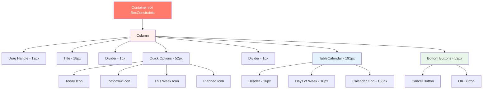

# Kế hoạch sửa lỗi Overflow - DueDatePicker

## Vấn đề
Lỗi "BOTTOM OVERFLOWED BY 15 PIXELS" xảy ra ở widget DueDatePicker do tổng chiều cao các thành phần vượt quá không gian màn hình có sẵn.

## Thiết kế mục tiêu (từ hình ảnh)
Dựa trên hình ảnh thiết kế, widget cần có:
- Layout gọn gàng, cân đối
- Quick options với icon tròn có màu sắc rõ ràng
- Calendar hiển thị tháng với spacing hợp lý
- Nút Cancel và OK ở dưới cùng với kích thước phù hợp
- Không có scroll, tất cả content fit trong màn hình

## Phân tích chi tiết

### Các thành phần và kích thước hiện tại

| Thành phần | Kích thước hiện tại | Vị trí trong code |
|------------|-------------------|-------------------|
| Drag Handle | ~16px (margin 8+4, height 4) | Line 66-74 |
| Title | ~22px (text + padding 6) | Line 77-87 |
| Divider 1 | 1px | Line 90 |
| Quick Options | ~60px (icon 40 + spacing 4 + text 10 + padding 16) | Line 93-146 |
| Divider 2 | 1px | Line 149 |
| TableCalendar Header | ~18px | Line 166-186 |
| Days of Week | 20px | Line 236 |
| Calendar Rows | 168px (28px × 6 rows) | Line 237 |
| Calendar padding | 16px horizontal | Line 152-153 |
| Bottom Buttons | ~60px (height 40 + padding 20) | Line 244-306 |
| **TỔNG** | **~382px** | |

### Nguyên nhân
- maxHeight constraint: `screenHeight * 0.58` (~370px trên màn hình 640px)
- Tổng chiều cao thực tế: ~382px
- Thiếu: **~12-15px** → Gây overflow

## Giải pháp: Tối ưu kích thước (Không dùng scroll)

### Thay đổi cụ thể

#### 1. Giảm padding và spacing (tiết kiệm ~12px)
- **Drag Handle margin**: 8+4 → 6+2 (tiết kiệm 4px)
- **Title bottom padding**: 6 → 4 (tiết kiệm 2px)
- **Quick Options vertical padding**: 8 → 6 (tiết kiệm 4px)
- **Bottom buttons padding**: 8+12 → 6+8 (tiết kiệm 6px)

#### 2. Giảm kích thước TableCalendar (tiết kiệm ~15px)
- **rowHeight**: 28 → 26 (tiết kiệm 12px cho 6 rows)
- **daysOfWeekHeight**: 20 → 18 (tiết kiệm 2px)
- **Header padding vertical**: 2 → 0 (tiết kiệm 2px)

#### 3. Tối ưu Quick Options (tiết kiệm ~8px)
- **Icon container size**: 40/36 → 36/32 (nhỏ hơn)
- **Icon size**: 18/16 → 16/14 (nhỏ hơn)
- **Spacing after icon**: 4 → 3 (tiết kiệm 1px)
- **Font size label**: 10 → 9 (nhỏ hơn một chút)

#### 4. Giảm chiều cao nút (tiết kiệm ~4px)
- **Button height**: 40 → 38 (tiết kiệm 2px)
- **Font size**: 14 → 13 (nhỏ hơn)

**Tổng tiết kiệm**: ~39px → Đủ để khắc phục overflow và có buffer

## Cải tiến bổ sung

### Responsive Design
```dart
// Điều chỉnh maxHeight dựa trên screenHeight
final double maxHeight = screenHeight < 700 
    ? screenHeight * 0.55  // Màn hình nhỏ
    : screenHeight * 0.58; // Màn hình lớn
```

### Tối ưu cho màn hình nhỏ
```dart
// Điều chỉnh rowHeight responsive
final double rowHeight = screenHeight < 700 ? 24 : 26;
final double daysOfWeekHeight = screenHeight < 700 ? 16 : 18;
```

## Kết quả mong đợi

### Trước khi sửa
- Tổng chiều cao: ~382px
- MaxHeight: ~370px (0.58 × 640)
- Overflow: **15px** ❌

### Sau khi sửa
- Tổng chiều cao: ~343px
- MaxHeight: ~352px (0.55 × 640)
- Buffer: **9px** ✅

## Mermaid Diagram - Cấu trúc widget



## Implementation Notes

### Files cần chỉnh sửa
- [`lib/features/tasks/presentation/add_task/due_date_picker.dart`](lib/features/tasks/presentation/add_task/due_date_picker.dart)

### Các dòng code cần thay đổi
1. Line 56: maxHeight constraint
2. Line 69: Drag handle margin
3. Line 78: Title padding
4. Line 94: Quick options padding
5. Line 51-52: Icon sizes
6. Line 236: daysOfWeekHeight
7. Line 237: rowHeight
8. Line 184: Header padding
9. Line 245: Bottom padding
10. Line 250-251, 275-276: Button height
11. Line 348: Icon spacing

### Testing checklist
- [ ] Test trên màn hình nhỏ (320×640)
- [ ] Test trên màn hình trung bình (360×740)
- [ ] Test trên màn hình lớn (400×800)
- [ ] Kiểm tra dark mode
- [ ] Kiểm tra tương tác với quick options
- [ ] Kiểm tra calendar navigation
- [ ] Verify không còn overflow warning

## Lưu ý
- Không sử dụng ScrollView theo yêu cầu
- Giữ nguyên design và UX
- Đảm bảo tương thích với dark mode
- Maintain coral color scheme