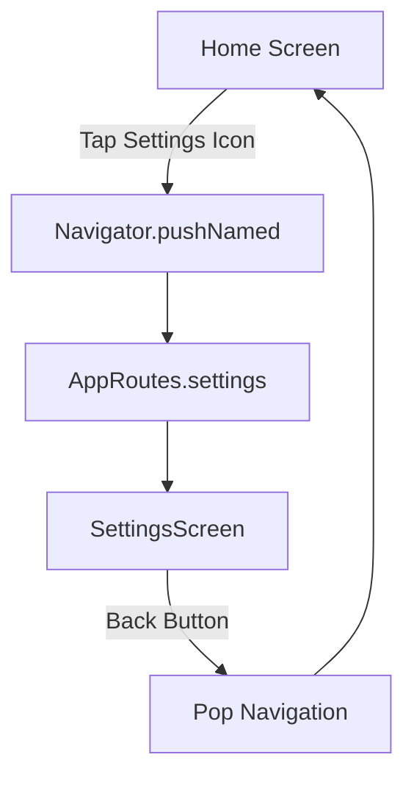

# Kế Hoạch: Sửa Lỗi Settings Icon Không Hoạt Động

## 📋 Tổng Quan Vấn Đề

**Mô tả vấn đề:**
- Icon Settings ở góc trên bên phải màn hình Home không có hành động khi người dùng ấn vào
- Icon chỉ hiển thị tĩnh mà không có event handler

**Vị trí lỗi:**
- File: [`lib/features/home/presentation/home_screen.dart`](../lib/features/home/presentation/home_screen.dart:283)
- Dòng 283: `Icon(Icons.settings_outlined, color: Colors.white, size: iconSize)`

## 🔍 Phân Tích Nguyên Nhân

### Tình Trạng Hiện Tại

1. **Icon Settings không có handler:**
   ```dart
   Icon(Icons.settings_outlined, color: Colors.white, size: iconSize)
   ```
   - Icon được hiển thị nhưng không được bọc trong `GestureDetector` hoặc `IconButton`
   - Không có callback `onTap` nào được định nghĩa

2. **Màn hình Settings đã tồn tại:**
   - File: [`lib/features/settings/presentation/settings_screen.dart`](../lib/features/settings/presentation/settings_screen.dart)
   - Đã có đầy đủ các tính năng: Profile, App Appearance, Backup & Sync, Notifications, v.v.

3. **Routing đã được cấu hình:**
   - Route: `AppRoutes.settings` = '/settings'
   - Đã được định nghĩa trong [`lib/routes/app_routes.dart`](../lib/routes/app_routes.dart:30)
   - Route handler đã có tại dòng 58-59

### So Sánh Với Icons Khác

**Icon Notifications (bên trái):**
- Cũng không có handler hiện tại
- Có thể sẽ cần thêm sau

**Icon giữa (Task Selector):**
- Có `GestureDetector` với `onTap`
- Mở `TaskBottomSheet`

## 💡 Giải Pháp

### Cách Tiếp Cận

Thêm `GestureDetector` hoặc `IconButton` để wrap Settings icon và thêm navigation handler.

### Lựa Chọn Implementation

**Option 1: Sử dụng GestureDetector** (Khuyến nghị)
- Ưu điểm: Nhất quán với Task Selector hiện tại
- Linh hoạt cho custom touch area

**Option 2: Sử dụng IconButton**
- Ưu điểm: Built-in Material Design ripple effect
- Semantic accessibility tốt hơn

## 📝 Chi Tiết Thực Hiện

### Bước 1: Thêm Navigation Handler

**File:** [`lib/features/home/presentation/home_screen.dart`](../lib/features/home/presentation/home_screen.dart:283)

**Thay đổi tại method `_buildTopBar`:**

```dart
Widget _buildTopBar(double screenWidth) {
  final iconSize = screenWidth < 360 ? 22.0 : 26.0;
  final titleSize = screenWidth < 360 ? 18.0 : 20.0;

  return Container(
    padding: EdgeInsets.symmetric(
      horizontal: screenWidth * 0.05,
      vertical: 10,
    ),
    child: Row(
      mainAxisAlignment: MainAxisAlignment.spaceBetween,
      children: [
        Icon(
          Icons.notifications_outlined,
          color: Colors.white,
          size: iconSize,
        ),
        Text(
          'Moji Focus',
          style: TextStyle(
            color: Colors.white,
            fontSize: titleSize,
            fontWeight: FontWeight.w600,
            letterSpacing: 0.5,
          ),
        ),
        // THAY ĐỔI: Thêm GestureDetector
        GestureDetector(
          onTap: () {
            Navigator.pushNamed(context, AppRoutes.settings);
          },
          child: Icon(
            Icons.settings_outlined, 
            color: Colors.white, 
            size: iconSize,
          ),
        ),
      ],
    ),
  );
}
```

**Hoặc sử dụng IconButton:**

```dart
IconButton(
  icon: Icon(
    Icons.settings_outlined,
    color: Colors.white,
    size: iconSize,
  ),
  onPressed: () {
    Navigator.pushNamed(context, AppRoutes.settings);
  },
  padding: EdgeInsets.zero,
  constraints: const BoxConstraints(),
)
```

### Bước 2: Import Route Constants

**Đảm bảo import đã có:**
```dart
import '../../../routes/app_routes.dart';
```

**Kiểm tra:** File [`home_screen.dart`](../lib/features/home/presentation/home_screen.dart) hiện tại chưa import `app_routes.dart`, cần thêm import này.

### Bước 3: Xử Lý Context

**Lưu ý quan trọng:**
- Method `_buildTopBar` nhận `screenWidth` làm parameter
- Cần truyền `context` vào method hoặc sử dụng `context` từ `build` method
- Hiện tại method không có access tới `context`

**Giải pháp:**
```dart
// Thay đổi signature của method
Widget _buildTopBar(BuildContext context, double screenWidth) {
  // ... code
}

// Update nơi gọi method
_buildTopBar(context, screenWidth),  // thay vì _buildTopBar(screenWidth)
```

## 🎯 Kế Hoạch Thực Hiện Chi Tiết

### Step 1: Thêm Import
- Thêm import cho `AppRoutes` vào đầu file [`home_screen.dart`](../lib/features/home/presentation/home_screen.dart)

### Step 2: Cập Nhật Method Signature
- Thay đổi `_buildTopBar(double screenWidth)` 
- Thành `_buildTopBar(BuildContext context, double screenWidth)`
- Update call site tại dòng 151

### Step 3: Thêm Navigation Handler
- Wrap Settings icon với `GestureDetector`
- Thêm `onTap` callback để navigate tới Settings screen

### Step 4: Testing
- Build và chạy app
- Kiểm tra Settings icon có hoạt động không
- Verify màn hình Settings hiển thị đúng

## ✅ Acceptance Criteria

1. ✓ Settings icon có thể được ấn
2. ✓ Khi ấn vào Settings icon, ứng dụng navigate tới SettingsScreen
3. ✓ Màn hình Settings hiển thị đầy đủ các tùy chọn
4. ✓ Người dùng có thể quay lại Home screen bằng nút back
5. ✓ Không có lỗi runtime hoặc navigation issues

## 🔄 Cải Tiến Tương Lai (Optional)

1. **Notifications Icon:**
   - Thêm handler cho Notifications icon bên trái
   - Có thể mở notifications screen hoặc bottom sheet

2. **Visual Feedback:**
   - Thêm ripple effect khi ấn icon
   - Có thể thêm splash color

3. **Accessibility:**
   - Thêm `Semantics` widget cho screen readers
   - Tooltip cho các icons

## 📊 Diagram Luồng Navigation



## 🎨 UI/UX Considerations

1. **Touch Target Size:**
   - Icon size hiện tại: 22-26px dựa trên screen width
   - Khuyến nghị touch target: tối thiểu 48x48px (Material Design)
   - `GestureDetector` cho phép custom touch area

2. **Visual Feedback:**
   - `IconButton` cung cấp Material ripple effect tự động
   - `GestureDetector` cần thêm `InkWell` nếu muốn ripple

3. **Consistency:**
   - Task Selector sử dụng `GestureDetector`
   - Nên giữ consistency bằng cách dùng `GestureDetector` cho Settings icon

## 🚀 Kết Luận

Đây là một bug đơn giản do thiếu event handler. Giải pháp rất straightforward:
1. Thêm import cho AppRoutes
2. Update method signature để có access tới context
3. Wrap icon với GestureDetector và navigation handler

Sau khi hoàn thành, Settings icon sẽ hoạt động bình thường và người dùng có thể truy cập màn hình Settings.