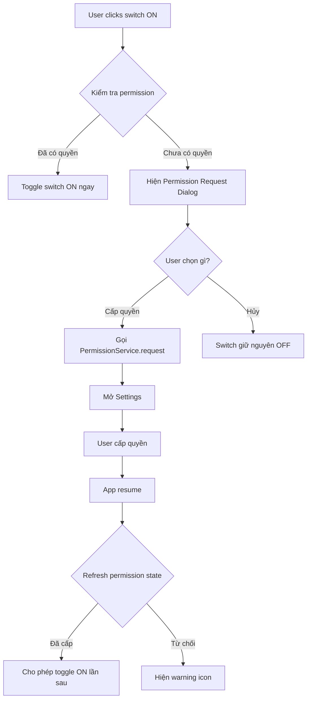

# Kế Hoạch Fix: Popup Permission Không Hiện Khi Toggle Strict Mode

## Vấn Đề Hiện Tại

### Mô tả vấn đề
User không thấy popup thông báo cần cấp quyền khi bật các tính năng Strict Mode cần permission (như "Chặn thông báo" hoặc "Chặn ứng dụng khác").

### Root Cause Analysis

#### 1. Flow hiện tại (SAI)
```
User mở Strict Mode Dialog
  → Toggle "Chặn thông báo" ON
  → Click "Lưu"
  → Dialog đóng, settings được lưu
  → Click "Start Timer"
  → HomeCubit._applyStrictModeSettings() được gọi
  → Kiểm tra permission LẦN ĐẦU TIÊN
  → Nếu thiếu permission → Mở Settings (không rõ lý do)
```

**Vấn đề**: User không biết họ cần cấp quyền cho đến khi bấm Start Timer!

#### 2. Flow mong muốn (ĐÚNG)
```
User mở Strict Mode Dialog
  → Toggle "Chặn thông báo" ON
  → Kiểm tra permission NGAY LẬP TỨC
  → Nếu thiếu permission:
      → Hiện Permission Request Dialog
      → User chọn "Mở cài đặt" hoặc "Hủy"
      → Nếu "Hủy" → Switch giữ nguyên OFF
      → Nếu "Mở cài đặt" → Mở Settings → User cấp quyền
  → Nếu có permission:
      → Toggle ON thành công
  → Click "Lưu" → Settings được lưu
  → Click "Start Timer" → Tính năng hoạt động ngay
```

### Code Analysis

#### File: [`lib/features/home/presentation/widgets/strict_mode_dialog.dart`](lib/features/home/presentation/widgets/strict_mode_dialog.dart)

**Dòng 68-89** - Block Notifications Switch:
```dart
_buildSwitchTile(
  title: 'Chặn thông báo',
  value: _blockNotifications,
  onChanged: (value) => setState(() => _blockNotifications = value), // ❌ KHÔNG có permission check!
  subtitle: 'Tắt tất cả thông báo khi tập trung',
),
```

**Dòng 84-89** - Block Other Apps Switch:
```dart
_buildSwitchTile(
  title: 'Chặn ứng dụng khác',
  value: _blockOtherApps,
  onChanged: (value) => setState(() => _blockOtherApps = value), // ❌ KHÔNG có permission check!
  subtitle: 'Ngăn mở các ứng dụng gây xao nhãng',
),
```

**Vấn đề**: `onChanged` chỉ update local state, KHÔNG kiểm tra permission!

#### File: [`lib/features/home/domain/home_cubit.dart`](lib/features/home/domain/home_cubit.dart)

**Dòng 848-882** - Method `checkAndRequestPermissionFor()`:
```dart
Future<bool> checkAndRequestPermissionFor(StrictModeFeature feature) async {
  // ✅ Method này đã có, nhưng CHƯA được gọi từ Dialog!
}
```

**Dòng 898-941** - Method `_applyStrictModeSettings()`:
```dart
void _applyStrictModeSettings() async {
  // ✅ Method này check permission, nhưng CHỈ được gọi khi START TIMER
  // ❌ KHÔNG được gọi khi user toggle switch trong dialog
}
```

## Giải Pháp

### Tổng Quan

Implement permission check **NGAY KHI** user toggle switch ON trong Strict Mode Dialog, theo đúng kế hoạch trong [`strict_mode_permission_handling_plan.md`](plans/strict_mode_permission_handling_plan.md).

### Architecture



## Implementation Plan

### Phase 1: Tạo Permission Request Dialog Component

**File: [`lib/features/home/presentation/widgets/strict_mode_dialog.dart`](lib/features/home/presentation/widgets/strict_mode_dialog.dart)**

Thêm widget mới:

```dart
/// Dialog yêu cầu người dùng cấp quyền
class _PermissionRequestDialog extends StatelessWidget {
  final String featureName;
  final String permissionName;
  final VoidCallback onGrantPermission;
  final VoidCallback onCancel;

  const _PermissionRequestDialog({
    required this.featureName,
    required this.permissionName,
    required this.onGrantPermission,
    required this.onCancel,
  });

  @override
  Widget build(BuildContext context) {
    return AlertDialog(
      shape: RoundedRectangleBorder(
        borderRadius: BorderRadius.circular(FigmaSpacing.radiusLg),
      ),
      backgroundColor: FigmaColors.white,
      title: Row(
        children: [
          Icon(Icons.security, color: FigmaColors.warning, size: 24),
          const SizedBox(width: 8),
          Text(
            'Cần cấp quyền',
            style: FigmaTextStyles.h4.copyWith(color: FigmaColors.textPrimary),
          ),
        ],
      ),
      content: Text(
        'Để sử dụng tính năng "$featureName", bạn cần cấp quyền "$permissionName" cho ứng dụng.\n\nBạn có muốn mở cài đặt để cấp quyền?',
        style: FigmaTextStyles.bodyMedium.copyWith(
          color: FigmaColors.textSecondary,
        ),
      ),
      actions: [
        TextButton(
          onPressed: onCancel,
          child: Text(
            'Hủy',
            style: FigmaTextStyles.labelMedium.copyWith(
              color: FigmaColors.textSecondary,
            ),
          ),
        ),
        ElevatedButton(
          onPressed: onGrantPermission,
          style: ElevatedButton.styleFrom(
            backgroundColor: FigmaColors.primary,
            foregroundColor: FigmaColors.white,
            shape: RoundedRectangleBorder(
              borderRadius: BorderRadius.circular(FigmaSpacing.radiusMd),
            ),
          ),
          child: Text(
            'Mở cài đặt',
            style: FigmaTextStyles.labelMedium.copyWith(
              color: FigmaColors.white,
            ),
          ),
        ),
      ],
    );
  }
}
```

### Phase 2: Cập nhật `_StrictModeDialogState` với Permission Handling

**File: [`lib/features/home/presentation/widgets/strict_mode_dialog.dart`](lib/features/home/presentation/widgets/strict_mode_dialog.dart)**

#### A. Thêm helper methods

Thêm vào class `_StrictModeDialogState`:

```dart
/// Handle toggle với permission check
Future<void> _handleToggle({
  required bool newValue,
  required StrictModeFeature feature,
  required ValueChanged<bool> onSuccess,
}) async {
  if (!newValue) {
    // Turning OFF - không cần permission
    onSuccess(newValue);
    return;
  }
  
  // Turning ON - kiểm tra permission trước
  final homeCubit = context.read<HomeCubit>();
  final hasPermission = await homeCubit.checkAndRequestPermissionFor(feature);
  
  if (!hasPermission && mounted) {
    // Chưa có permission → Hiện dialog yêu cầu
    final shouldRequest = await showDialog<bool>(
      context: context,
      builder: (context) => _PermissionRequestDialog(
        featureName: _getFeatureName(feature),
        permissionName: _getPermissionName(feature),
        onGrantPermission: () => Navigator.of(context).pop(true),
        onCancel: () => Navigator.of(context).pop(false),
      ),
    );
    
    if (shouldRequest == true) {
      // User muốn cấp quyền → Gọi request
      await homeCubit.checkAndRequestPermissionFor(feature);
      
      // Hiện thông báo hướng dẫn
      if (mounted) {
        ScaffoldMessenger.of(context).showSnackBar(
          SnackBar(
            content: const Text(
              'Vui lòng cấp quyền trong cài đặt, sau đó quay lại và thử lại',
              style: TextStyle(color: Colors.white, fontWeight: FontWeight.w600),
            ),
            backgroundColor: FigmaColors.warning,
            duration: const Duration(seconds: 3),
            behavior: SnackBarBehavior.floating,
            shape: RoundedRectangleBorder(
              borderRadius: BorderRadius.circular(FigmaSpacing.radiusMd),
            ),
          ),
        );
      }
    }
    return; // KHÔNG toggle switch
  }
  
  // Có permission → Cho phép toggle
  onSuccess(newValue);
}

/// Lấy tên tính năng để hiển thị
String _getFeatureName(StrictModeFeature feature) {
  switch (feature) {
    case StrictModeFeature.blockNotifications:
      return 'Chặn thông báo';
    case StrictModeFeature.blockOtherApps:
      return 'Chặn ứng dụng khác';
    case StrictModeFeature.blockPhoneCalls:
      return 'Chặn cuộc gọi';
    case StrictModeFeature.lockPhone:
      return 'Giữ màn hình sáng';
    case StrictModeFeature.prohibitExit:
      return 'Cấm thoát ứng dụng';
  }
}

/// Lấy tên permission để hiển thị
String _getPermissionName(StrictModeFeature feature) {
  switch (feature) {
    case StrictModeFeature.blockNotifications:
      return 'Do Not Disturb';
    case StrictModeFeature.blockOtherApps:
      return 'Accessibility Service';
    default:
      return 'Unknown';
  }
}
```

#### B. Cập nhật build method

Thay đổi các switch tile để sử dụng `_handleToggle`:

**TRƯỚC:**
```dart
_buildSwitchTile(
  title: 'Chặn thông báo',
  value: _blockNotifications,
  onChanged: (value) => setState(() => _blockNotifications = value), // ❌
  subtitle: 'Tắt tất cả thông báo khi tập trung',
),
```

**SAU:**
```dart
_buildSwitchTile(
  title: 'Chặn thông báo',
  value: _blockNotifications,
  onChanged: (value) => _handleToggle( // ✅
    newValue: value,
    feature: StrictModeFeature.blockNotifications,
    onSuccess: (v) => setState(() => _blockNotifications = v),
  ),
  subtitle: currentState.hasDNDPermission
      ? 'Tắt tất cả thông báo khi tập trung'
      : 'Cần cấp quyền Do Not Disturb',
  requiresPermission: true,
  hasPermission: currentState.hasDNDPermission,
),
```

Làm tương tự cho "Chặn ứng dụng khác":

```dart
_buildSwitchTile(
  title: 'Chặn ứng dụng khác',
  value: _blockOtherApps,
  onChanged: (value) => _handleToggle( // ✅
    newValue: value,
    feature: StrictModeFeature.blockOtherApps,
    onSuccess: (v) => setState(() => _blockOtherApps = v),
  ),
  subtitle: currentState.hasAccessibilityPermission
      ? 'Ngăn mở các ứng dụng gây xao nhãng'
      : 'Cần bật Accessibility Service',
  requiresPermission: true,
  hasPermission: currentState.hasAccessibilityPermission,
),
```

#### C. Cập nhật `_buildSwitchTile` để hiển thị warning icon

Thêm parameters mới:

```dart
Widget _buildSwitchTile({
  required String title,
  required bool value,
  required ValueChanged<bool>? onChanged,
  String? subtitle,
  bool requiresPermission = false,  // NEW
  bool hasPermission = true,        // NEW
}) {
  final isEnabled = onChanged != null;
  final showWarning = requiresPermission && !hasPermission;

  return Padding(
    padding: const EdgeInsets.only(bottom: FigmaSpacing.sm),
    child: Row(
      children: [
        Expanded(
          child: Column(
            crossAxisAlignment: CrossAxisAlignment.start,
            children: [
              Row(
                children: [
                  Text(
                    title,
                    style: FigmaTextStyles.bodyMedium.copyWith(
                      fontSize: 16,
                      color: isEnabled
                          ? FigmaColors.textPrimary
                          : FigmaColors.textSecondary,
                    ),
                  ),
                  if (showWarning) ...[
                    const SizedBox(width: 4),
                    Icon(
                      Icons.warning_amber_rounded,
                      size: 16,
                      color: FigmaColors.warning,
                    ),
                  ],
                ],
              ),
              if (subtitle != null) ...[
                const SizedBox(height: 2),
                Text(
                  subtitle,
                  style: FigmaTextStyles.bodySmall.copyWith(
                    color: showWarning 
                        ? FigmaColors.warning 
                        : FigmaColors.textTertiary,
                  ),
                ),
              ],
            ],
          ),
        ),
        const SizedBox(width: FigmaSpacing.md),
        Transform.scale(
          scale: 0.9,
          child: Switch(
            value: value,
            onChanged: onChanged,
            activeColor: FigmaColors.primary,
            activeTrackColor: FigmaColors.primary.withOpacity(0.5),
            inactiveThumbColor: Colors.grey.shade400,
            inactiveTrackColor: Colors.grey.shade300,
          ),
        ),
      ],
    ),
  );
}
```

#### D. Wrap build method với BlocBuilder

Để có thể truy cập permission states:

**TRƯỚC:**
```dart
@override
Widget build(BuildContext context) {
  return AlertDialog(
    // ...
  );
}
```

**SAU:**
```dart
@override
Widget build(BuildContext context) {
  return BlocBuilder<HomeCubit, HomeState>(
    builder: (context, currentState) {
      return AlertDialog(
        // ... có thể dùng currentState.hasDNDPermission, etc.
      );
    },
  );
}
```

### Phase 3: Cập nhật HomeCubit (Đã có sẵn, chỉ cần verify)

**File: [`lib/features/home/domain/home_cubit.dart`](lib/features/home/domain/home_cubit.dart)**

#### Verify các methods đã có:

✅ **Dòng 848-882** - `checkAndRequestPermissionFor()` - ĐÃ CÓ
✅ **Dòng 884-895** - `refreshPermissionStates()` - ĐÃ CÓ  
✅ **Dòng 92-93** - `PermissionService _permissionService` - ĐÃ CÓ

**KHÔNG CẦN thay đổi gì trong HomeCubit!** Các methods cần thiết đã được implement.

### Phase 4: Cập nhật App Lifecycle Handler

**File: [`lib/features/home/presentation/home_screen_state_manager.dart`](lib/features/home/presentation/home_screen_state_manager.dart)**

#### Verify lifecycle handling

✅ **Dòng 80-98** - `handleAppLifecycleState()` - ĐÃ CÓ refresh permissions khi app resume!

```dart
Future<void> handleAppLifecycleState(AppLifecycleState state) async {
  // ...
  else if (state == AppLifecycleState.resumed) {
    // ...
    // NEW: Refresh permission states when app resumes
    try {
      final homeCubit = context.read<HomeCubit>();
      await homeCubit.refreshPermissionStates();
      print('Refreshed permission states after app resume.');
    } catch (e) {
      print('Error refreshing permission states: $e');
    }
  }
}
```

**KHÔNG CẦN thay đổi!** Logic refresh đã được implement.

### Phase 5: Thêm FigmaColors.warning nếu chưa có

**File: [`lib/core/themes/design_tokens.dart`](lib/core/themes/design_tokens.dart)**

Kiểm tra và thêm nếu chưa có:

```dart
class FigmaColors {
  // ... existing colors ...
  static const Color warning = Color(0xFFFFA726); // Orange warning color
  // ... rest of colors ...
}
```

## Testing Plan

### Unit Tests

#### Test 1: Toggle switch với permission đã có
```
GIVEN: User đã cấp DND permission (hasDNDPermission = true)
WHEN: User toggle "Chặn thông báo" ON
THEN: 
  - Switch bật ngay
  - KHÔNG hiện Permission Request Dialog
  - _blockNotifications = true
```

#### Test 2: Toggle switch chưa có permission → User cấp quyền
```
GIVEN: User chưa cấp DND permission (hasDNDPermission = false)
WHEN: User toggle "Chặn thông báo" ON
THEN:
  - Permission Request Dialog hiện ra
  - User click "Mở cài đặt"
  - Settings mở ra
  - User cấp quyền
  - App resume
  - refreshPermissionStates() được gọi
  - hasDNDPermission = true
```

#### Test 3: Toggle switch chưa có permission → User từ chối
```
GIVEN: User chưa cấp DND permission
WHEN: User toggle "Chặn thông báo" ON
THEN:
  - Permission Request Dialog hiện ra
  - User click "Hủy"
  - Dialog đóng
  - Switch giữ nguyên OFF
  - _blockNotifications = false
```

#### Test 4: Warning icon hiển thị đúng
```
GIVEN: User chưa cấp DND permission
WHEN: Mở Strict Mode Dialog
THEN:
  - "Chặn thông báo" switch có warning icon màu vàng
  - Subtitle hiển thị "Cần cấp quyền Do Not Disturb"
```

#### Test 5: App resume refresh permissions
```
GIVEN: User đang ở Strict Mode Dialog
WHEN: 
  - User mở Settings (qua Permission Request Dialog)
  - User cấp quyền
  - User quay lại app
THEN:
  - handleAppLifecycleState(resumed) được gọi
  - refreshPermissionStates() được gọi
  - hasDNDPermission cập nhật = true
  - Warning icon biến mất
  - Subtitle đổi thành "Tắt tất cả thông báo khi tập trung"
```

### Integration Tests

#### Scenario 1: Full flow - Thành công
```
1. User mở Strict Mode Dialog
2. Chưa có DND permission
3. Toggle "Chặn thông báo" ON
4. Permission Request Dialog hiện
5. Click "Mở cài đặt"
6. Cấp quyền trong Settings
7. Quay lại app
8. Mở lại Strict Mode Dialog
9. Toggle "Chặn thông báo" ON → Thành công ngay
10. Click "Lưu"
11. Start Timer
12. DND mode hoạt động ✅
```

#### Scenario 2: Full flow - Từ chối permission
```
1. User mở Strict Mode Dialog
2. Toggle "Chặn thông báo" ON
3. Permission Request Dialog hiện
4. Click "Hủy" → Switch vẫn OFF
5. Toggle lại → Dialog hiện lại
6. Click "Mở cài đặt" → Từ chối permission
7. Quay lại app
8. Warning icon vẫn hiện
9. Toggle lại → Dialog hiện lại
10. (User phải vào Settings manual để cấp quyền)
```

#### Scenario 3: Multiple switches cần permission
```
1. Toggle "Chặn thông báo" → Request DND permission
2. Cấp quyền
3. Toggle "Chặn ứng dụng khác" → Request Accessibility permission
4. Cấp quyền
5. Cả hai switches đều ON
6. Click "Lưu"
7. Start Timer → Cả hai tính năng hoạt động ✅
```

## Files Changed Summary

### Modified Files

1. **[`lib/features/home/presentation/widgets/strict_mode_dialog.dart`](lib/features/home/presentation/widgets/strict_mode_dialog.dart)**
   - Thêm `_PermissionRequestDialog` widget
   - Thêm `_handleToggle()` method
   - Thêm `_getFeatureName()` và `_getPermissionName()` methods
   - Cập nhật `_buildSwitchTile()` với warning icon support
   - Cập nhật `build()` method với BlocBuilder
   - Cập nhật các switch tiles để sử dụng `_handleToggle()`

2. **[`lib/core/themes/design_tokens.dart`](lib/core/themes/design_tokens.dart)** (nếu cần)
   - Thêm `FigmaColors.warning` nếu chưa có

### No Changes Needed

- ✅ [`lib/features/home/domain/home_cubit.dart`](lib/features/home/domain/home_cubit.dart) - Đã có đủ methods
- ✅ [`lib/features/home/domain/home_state.dart`](lib/features/home/domain/home_state.dart) - Đã có permission fields
- ✅ [`lib/core/services/permission_service.dart`](lib/core/services/permission_service.dart) - Đã có đủ methods
- ✅ [`lib/features/home/presentation/home_screen_state_manager.dart`](lib/features/home/presentation/home_screen_state_manager.dart) - Đã có lifecycle handling

## Implementation Checklist

- [ ] **Phase 1**: Tạo `_PermissionRequestDialog` widget
- [ ] **Phase 2**: Cập nhật `_StrictModeDialogState`
  - [ ] Thêm `_handleToggle()` method
  - [ ] Thêm `_getFeatureName()` method
  - [ ] Thêm `_getPermissionName()` method
  - [ ] Cập nhật `_buildSwitchTile()` với warning support
  - [ ] Wrap `build()` với BlocBuilder
  - [ ] Cập nhật "Chặn thông báo" switch
  - [ ] Cập nhật "Chặn ứng dụng khác" switch
- [ ] **Phase 3**: Verify HomeCubit methods (không cần sửa)
- [ ] **Phase 4**: Verify lifecycle handler (không cần sửa)
- [ ] **Phase 5**: Kiểm tra và thêm `FigmaColors.warning` nếu cần
- [ ] **Testing**: Chạy tất cả test cases
- [ ] **Review**: Code review và polish

## Expected Behavior After Implementation

### ✅ User Experience Được Cải Thiện

**TRƯỚC (Hiện tại - Tệ):**
```
❌ Bật "Chặn thông báo" → Không biết cần quyền
❌ Click Lưu → Không có warning
❌ Start Timer → Đột nhiên mở Settings (rất confusing!)
❌ Không biết tại sao phải cấp quyền
❌ Nếu từ chối → Không có feedback
```

**SAU (Mới - Tốt):**
```
✅ Bật "Chặn thông báo" → Ngay lập tức kiểm tra permission
✅ Nếu thiếu → Popup rõ ràng: "Cần cấp quyền Do Not Disturb"
✅ User chọn "Mở cài đặt" hoặc "Hủy" - có control
✅ Nếu cấp quyền → Toggle thành công
✅ Nếu từ chối → Warning icon hiện, subtitle giải thích
✅ Start Timer → Tính năng hoạt động ngay (vì đã có quyền)
```

## Notes

- Tất cả text phải bằng Tiếng Việt
- Permission request không block UI - sử dụng async/await
- Graceful degradation nếu user từ chối permission
- Clear visual feedback (warning icon màu vàng/cam)
- User-friendly error messages
- Không crash app trong mọi trường hợp

## References

- Base Plan: [`strict_mode_permission_handling_plan.md`](plans/strict_mode_permission_handling_plan.md)
- Permission Service: [`permission_service.dart`](lib/core/services/permission_service.dart)
- Home Cubit: [`home_cubit.dart`](lib/features/home/domain/home_cubit.dart)
- Strict Mode Dialog: [`strict_mode_dialog.dart`](lib/features/home/presentation/widgets/strict_mode_dialog.dart)
- Design Tokens: [`design_tokens.dart`](lib/core/themes/design_tokens.dart)

## Mermaid Diagram: Complete Flow

```mermaid
sequenceDiagram
    participant U as User
    participant D as StrictModeDialog
    participant HC as HomeCubit
    participant PS as PermissionService
    participant S as Android Settings
    
    U->>D: Toggle "Chặn thông báo" ON
    D->>HC: checkAndRequestPermissionFor(blockNotifications)
    HC->>PS: checkDNDPermission()
    
    alt Đã có permission
        PS-->>HC: true
        HC-->>D: true
        D->>D: setState(_blockNotifications = true)
        Note over D: Switch bật ON thành công
    else Chưa có permission
        PS-->>HC: false
        HC->>PS: requestDNDPermission()
        PS->>S: Mở Settings
        HC-->>D: false
        D->>U: Hiện Permission Request Dialog
        
        alt User chọn "Mở cài đặt"
            U->>D: Click "Mở cài đặt"
            D->>HC: checkAndRequestPermissionFor() again
            HC->>PS: requestDNDPermission()
            PS->>S: Mở Settings
            U->>S: Cấp quyền
            S->>U: Quay lại app
            Note over U,D: App resume
            D->>HC: refreshPermissionStates()
            HC->>PS: checkDNDPermission()
            PS-->>HC: true
            HC->>HC: emit(hasDNDPermission: true)
            Note over D: Warning icon biến mất<br/>Có thể toggle ON lần sau
        else User chọn "Hủy"
            U->>D: Click "Hủy"
            D->>D: Switch giữ OFF
            Note over D: Warning icon hiện<br/>Subtitle: "Cần cấp quyền"
        end
    end