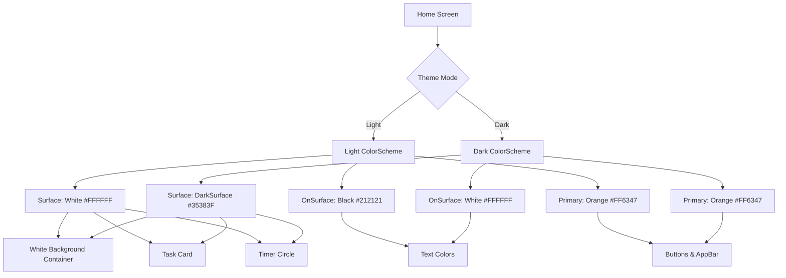

# Kế hoạch: Thêm Dark Mode Support cho Home Screen

## Tổng quan

Hiện tại [`home_screen.dart`](lib/features/home/presentation/home_screen.dart) đang sử dụng màu hardcoded, khiến màn hình không phản ánh Dark Mode khi người dùng bật trong Settings. Cần thay thế tất cả màu hardcoded bằng `Theme.of(context)` để hỗ trợ cả Light và Dark mode.

## Phân tích Màu Hardcoded

### 1. **Scaffold Background** (Dòng 135)
- **Hiện tại:** `backgroundColor: FigmaColors.primary` (màu cam #FF6347)
- **Vấn đề:** Luôn hiển thị màu cam dù ở Light hay Dark mode
- **Giải pháp:** Giữ nguyên `FigmaColors.primary` vì đây là màu chủ đạo của app, không thay đổi theo theme

### 2. **Top AppBar Icons & Text** (Dòng 270-290)
- **Hiện tại:** `color: Colors.white` (dòng 272, 278, 290)
- **Vấn đề:** Icons và text luôn màu trắng
- **Giải pháp:** Giữ màu trắng vì nền AppBar là màu cam primary

### 3. **White Background Container** (Dòng 179-187)
- **Hiện tại:** `color: Colors.white`
- **Vấn đề:** Vùng trắng phía dưới không đổi màu trong Dark mode
- **Giải pháp:** 
  - Light mode: `Theme.of(context).colorScheme.surface` → `FigmaColors.white`
  - Dark mode: `Theme.of(context).colorScheme.surface` → `FigmaColors.darkSurface`

### 4. **Task Card** (Dòng 308-349)
- **Hiện tại:**
  - Background: `color: Colors.white` (dòng 314)
  - Shadow: `Colors.black.withOpacity(0.08)` (dòng 318)
  - Selected text: `Colors.black87` (dòng 334)
  - Placeholder text: `Colors.grey.shade500` (dòng 335)
  - Icon: `Colors.grey.shade700` (dòng 344)

- **Giải pháp:**
  - Background: `Theme.of(context).cardTheme.color` hoặc `Theme.of(context).colorScheme.surface`
  - Shadow: `Theme.of(context).shadowColor.withOpacity(0.08)`
  - Selected text: `Theme.of(context).colorScheme.onSurface`
  - Placeholder text: `Theme.of(context).textTheme.bodyMedium?.color?.withOpacity(0.6)`
  - Icon: `Theme.of(context).iconTheme.color`

### 5. **Timer Circle** (Dòng 377-431)
- **Hiện tại:**
  - Container background: `color: Colors.white` (dòng 382)
  - Shadow: `Colors.black.withOpacity(0.1)` (dòng 385)
  - Progress background: `Colors.grey.shade200` (dòng 402)
  - Time text: `Colors.black87` (dòng 415)
  - Session text: `Colors.grey.shade500` (dòng 423)

- **Giải pháp:**
  - Container: `Theme.of(context).colorScheme.surface`
  - Shadow: `Theme.of(context).shadowColor.withOpacity(0.1)`
  - Progress background: `Theme.of(context).colorScheme.surfaceVariant` hoặc tạo màu custom
  - Time text: `Theme.of(context).colorScheme.onSurface`
  - Session text: `Theme.of(context).textTheme.bodyMedium?.color`

### 6. **Start/Pause/Continue Buttons** (Dòng 463-592)
- **Hiện tại:** 
  - Icon & text: `color: Colors.white` (dòng 479, 482, 491, 586)
  - Background: `FigmaColors.primary`
- **Giải pháp:** Giữ nguyên vì nút chính luôn dùng primary color

### 7. **Stop Button** (Dòng 502-538)
- **Hiện tại:**
  - Background: `Colors.red.shade50` (dòng 518)
  - Text: `Colors.red.shade700` (dòng 531)
- **Giải pháp:** Cần tạo màu tương đương cho Dark mode
  - Light: Giữ nguyên
  - Dark: `Colors.red.shade900` (background), `Colors.red.shade300` (text)

### 8. **Quick Settings Icons** (Dòng 634-680)
- **Hiện tại:**
  - Border inactive: `Colors.grey.shade300` (dòng 654)
  - Icon inactive: `Colors.grey.shade600` (dòng 661)
  - Label inactive: `Colors.grey.shade600` (dòng 669)

- **Giải pháp:**
  - Border inactive: `Theme.of(context).dividerColor`
  - Icon inactive: `Theme.of(context).iconTheme.color?.withOpacity(0.6)`
  - Label inactive: `Theme.of(context).textTheme.bodySmall?.color`

### 9. **SnackBar** (Dòng 114-128)
- **Hiện tại:**
  - Text: `color: Colors.white` (dòng 118)
  - Background: `FigmaColors.primary` (dòng 122)
- **Giải pháp:** Giữ nguyên (đã dùng primary color)

## Ánh xạ Theme Colors

### Light Mode (đã có)
```dart
colorScheme: ColorScheme.light(
  primary: FigmaColors.primary,           // #FF6347
  surface: FigmaColors.white,             // #FFFFFF
  background: FigmaColors.background,     // #FAFAFA
  onSurface: FigmaColors.textPrimary,     // #212121
  onBackground: FigmaColors.textPrimary,  // #212121
)
```

### Dark Mode (đã có)
```dart
colorScheme: ColorScheme.dark(
  primary: FigmaColors.primary,           // #FF6347
  surface: FigmaColors.darkSurface,       // #35383F
  background: FigmaColors.darkBackground, // #130F26
  onSurface: FigmaColors.white,           // #FFFFFF
  onBackground: FigmaColors.white,        // #FFFFFF
)
```

## Các màu cần bổ sung vào Theme

Sau khi kiểm tra, Theme hiện tại **đã đủ** các màu cần thiết. Tuy nhiên cần lưu ý:

1. **Progress indicator background**: Có thể dùng `colorScheme.surfaceVariant` hoặc tạo màu từ `onSurface.withOpacity(0.1)`
2. **Stop button colors**: Cần xử lý theo brightness
3. **Shadow colors**: Dùng `shadowColor` từ theme

## Kế hoạch thực hiện

### Bước 1: Cập nhật White Background Container
**File:** [`home_screen.dart`](lib/features/home/presentation/home_screen.dart:179)

```dart
// Thay đổi từ:
color: Colors.white,

// Thành:
color: Theme.of(context).colorScheme.surface,
```

### Bước 2: Cập nhật Task Card
**File:** [`home_screen.dart`](lib/features/home/presentation/home_screen.dart:308)

Thay đổi trong method `_buildTaskCard()`:
- Background color → `Theme.of(context).cardTheme.color`
- Shadow color → `Theme.of(context).shadowColor`
- Text colors → `Theme.of(context).textTheme`
- Icon color → `Theme.of(context).iconTheme.color`

### Bước 3: Cập nhật Timer Circle
**File:** [`home_screen.dart`](lib/features/home/presentation/home_screen.dart:377)

Thay đổi trong method `_buildTimerCircle()`:
- Container background → `Theme.of(context).colorScheme.surface`
- Shadow → `Theme.of(context).shadowColor`
- Progress background → `Theme.of(context).colorScheme.onSurface.withOpacity(0.1)`
- Time text → `Theme.of(context).colorScheme.onSurface`
- Session text → `Theme.of(context).textTheme.bodyMedium?.color`

### Bước 4: Cập nhật Stop Button
**File:** [`home_screen.dart`](lib/features/home/presentation/home_screen.dart:502)

Thay đổi trong method `_buildStopButton()`:
```dart
final isDark = Theme.of(context).brightness == Brightness.dark;
backgroundColor: isDark ? Colors.red.shade900 : Colors.red.shade50,
color: isDark ? Colors.red.shade300 : Colors.red.shade700,
```

### Bước 5: Cập nhật Quick Settings Icons
**File:** [`home_screen.dart`](lib/features/home/presentation/home_screen.dart:634)

Thay đổi trong method `_buildSettingIcon()`:
- Border color → `Theme.of(context).dividerColor`
- Icon color → `Theme.of(context).iconTheme.color`
- Label color → `Theme.of(context).textTheme.bodySmall?.color`

## Chi tiết các thay đổi cần thực hiện

### 1. Thêm helper để lấy màu từ Theme
Tạo một số getter methods ở đầu `_HomeScreenState`:

```dart
Color _getCardBackgroundColor(BuildContext context) {
  return Theme.of(context).cardTheme.color ?? 
         Theme.of(context).colorScheme.surface;
}

Color _getTextColor(BuildContext context, {double opacity = 1.0}) {
  return (Theme.of(context).colorScheme.onSurface).withOpacity(opacity);
}

Color _getSecondaryTextColor(BuildContext context) {
  return Theme.of(context).textTheme.bodyMedium?.color ?? 
         _getTextColor(context, opacity: 0.6);
}
```

### 2. Danh sách chi tiết các dòng cần sửa

| Dòng | Màu hiện tại | Thay thế bằng | Widget |
|------|-------------|---------------|---------|
| 181 | `Colors.white` | `Theme.of(context).colorScheme.surface` | White background container |
| 314 | `Colors.white` | `Theme.of(context).cardTheme.color` | Task card background |
| 318 | `Colors.black.withOpacity(0.08)` | `Theme.of(context).shadowColor.withOpacity(0.08)` | Task card shadow |
| 334 | `Colors.black87` | `Theme.of(context).colorScheme.onSurface` | Task title (selected) |
| 335 | `Colors.grey.shade500` | `Theme.of(context).textTheme.bodyMedium?.color?.withOpacity(0.6)` | Task placeholder |
| 344 | `Colors.grey.shade700` | `Theme.of(context).iconTheme.color` | Task dropdown icon |
| 382 | `Colors.white` | `Theme.of(context).colorScheme.surface` | Timer circle background |
| 385 | `Colors.black.withOpacity(0.1)` | `Theme.of(context).shadowColor.withOpacity(0.1)` | Timer shadow |
| 402 | `Colors.grey.shade200` | `Theme.of(context).colorScheme.onSurface.withOpacity(0.1)` | Progress background |
| 415 | `Colors.black87` | `Theme.of(context).colorScheme.onSurface` | Timer text |
| 423 | `Colors.grey.shade500` | `Theme.of(context).textTheme.bodyMedium?.color` | Session text |
| 518 | `Colors.red.shade50` | `isDark ? Colors.red.shade900 : Colors.red.shade50` | Stop button bg |
| 531 | `Colors.red.shade700` | `isDark ? Colors.red.shade300 : Colors.red.shade700` | Stop button text |
| 654 | `Colors.grey.shade300` | `Theme.of(context).dividerColor` | Icon border (inactive) |
| 661 | `Colors.grey.shade600` | `Theme.of(context).iconTheme.color?.withOpacity(0.6)` | Icon (inactive) |
| 669 | `Colors.grey.shade600` | `Theme.of(context).textTheme.bodySmall?.color` | Icon label (inactive) |

## Lưu ý quan trọng

1. **Không thay đổi màu primary**: Màu cam `FigmaColors.primary` (#FF6347) là màu chủ đạo của app, giữ nguyên ở cả Light và Dark mode

2. **AppBar icons giữ màu trắng**: Vì background là màu cam nên icons và text phải màu trắng để dễ đọc

3. **Buttons chính giữ màu trắng**: Text và icons trên các nút primary (Start, Continue) giữ màu trắng vì nền là primary color

4. **Test kỹ cả 2 modes**: Sau khi thay đổi cần test kỹ với cả Light và Dark mode để đảm bảo tất cả màu hiển thị đúng và dễ đọc

5. **Null safety**: Khi dùng `Theme.of(context).textTheme.bodyMedium?.color` cần có fallback value

## Testing Checklist

Sau khi implement, cần test các scenarios sau:

- [ ] Light mode: Tất cả màu hiển thị đúng như thiết kế gốc
- [ ] Dark mode: Tất cả màu chuyển sang dark palette
- [ ] Chuyển đổi Light ↔ Dark: UI cập nhật ngay lập tức
- [ ] Timer Circle: Màu hiển thị rõ ràng ở cả 2 modes
- [ ] Task Card: Dễ đọc ở cả 2 modes
- [ ] Quick Settings Icons: Border và màu phân biệt rõ active/inactive
- [ ] Stop button: Màu đỏ vẫn nổi bật nhưng phù hợp với Dark mode
- [ ] Shadows: Hiển thị tự nhiên không quá đậm hay quá nhạt

## Diagram: Color Mapping Flow



## Ước tính công việc

Task này bao gồm:
- Sửa đổi 1 file: [`home_screen.dart`](lib/features/home/presentation/home_screen.dart)
- Số lượng thay đổi: ~16 vị trí
- Độ phức tạp: Trung bình (cần cẩn thận với null safety và fallback values)
- Testing: Cần test kỹ với cả Light và Dark mode

## Kết luận

Kế hoạch này đã xác định được tất cả các vị trí cần thay đổi màu hardcoded trong Home Screen. Theme hiện tại đã đủ các màu cần thiết cho Dark mode. Chỉ cần thay thế các màu hardcoded bằng `Theme.of(context)` tương ứng là Home Screen sẽ hỗ trợ Dark Mode hoàn chỉnh.