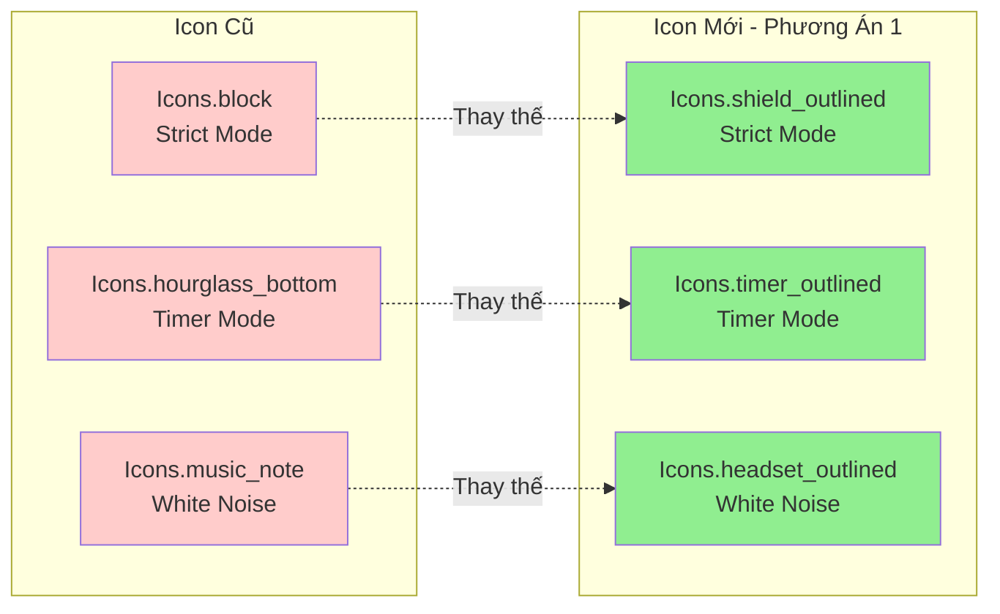

# Đề Xuất Thiết Kế Icon Mới Cho Trang Home

## 🎨 Minh Họa Trực Quan



## 📋 Tổng Quan

Thay đổi 3 icon chức năng ở trang Home để phù hợp với yêu cầu thi lại. Icons mới sẽ:
- Khác biệt rõ ràng với bản cũ
- Vẫn giữ đúng ý nghĩa chức năng
- Hiện đại và dễ nhận diện hơn
- Phù hợp với Material Design Icons có sẵn trong Flutter

## 🎯 Icons Hiện Tại

| Chức Năng | Icon Cũ | Mô Tả |
|-----------|---------|-------|
| Strict Mode | `Icons.block` | Icon cấm/chặn |
| Timer Mode | `Icons.hourglass_bottom` | Đồng hồ cát |
| White Noise | `Icons.music_note` | Nốt nhạc |

## ✨ Đề Xuất Icons Mới

### Phương Án 1: Hiện Đại & Chuyên Nghiệp (Khuyến Nghị)

```dart
// Trong _buildQuickSettingsIcons()
_buildSettingIcon(
  icon: Icons.shield_outlined,        // Thay Icons.block
  label: 'Strict Mode',
  // ... 
),
_buildSettingIcon(
  icon: Icons.timer_outlined,         // Thay Icons.hourglass_bottom
  label: 'Timer Mode',
  // ...
),
_buildSettingIcon(
  icon: Icons.headset_outlined,       // Thay Icons.music_note
  label: 'White Noise',
  // ...
),
```

**Lý do chọn:**
- **Shield** (khiên): Biểu tượng bảo vệ, ngăn chặn sao nhãng → phù hợp với Strict Mode
- **Timer**: Icon timer chuyên dụng → rõ ràng hơn đồng hồ cát
- **Headset**: Tai nghe → liên quan trực tiếp đến âm thanh/white noise

### Phương Án 2: Sáng Tạo & Độc Đáo

```dart
_buildSettingIcon(
  icon: Icons.lock_clock,             // Thay Icons.block
  label: 'Strict Mode',
  // ... 
),
_buildSettingIcon(
  icon: Icons.access_time_filled,     // Thay Icons.hourglass_bottom
  label: 'Timer Mode',
  // ...
),
_buildSettingIcon(
  icon: Icons.volume_up_outlined,     // Thay Icons.music_note
  label: 'White Noise',
  // ...
),
```

**Lý do chọn:**
- **Lock Clock**: Khóa + đồng hồ → khóa thời gian, không cho thoát
- **Access Time Filled**: Đồng hồ đầy → biểu thượng quản lý thời gian
- **Volume Up**: Icon âm lượng → liên quan âm thanh

### Phương Án 3: Tối Giản & Rõ Ràng

```dart
_buildSettingIcon(
  icon: Icons.security,               // Thay Icons.block
  label: 'Strict Mode',
  // ... 
),
_buildSettingIcon(
  icon: Icons.schedule,               // Thay Icons.hourglass_bottom
  label: 'Timer Mode',
  // ...
),
_buildSettingIcon(
  icon: Icons.speaker,                // Thay Icons.music_note
  label: 'White Noise',
  // ...
),
```

**Lý do chọn:**
- **Security**: Biểu tượng an ninh/bảo mật → chế độ nghiêm ngặt
- **Schedule**: Lịch trình/thời gian biểu → timer
- **Speaker**: Loa phát thanh → white noise

## 📊 So Sánh Chi Tiết

| Tiêu Chí | Phương Án 1 | Phương Án 2 | Phương Án 3 |
|----------|-------------|-------------|-------------|
| Độ khác biệt | ⭐⭐⭐⭐⭐ | ⭐⭐⭐⭐ | ⭐⭐⭐⭐ |
| Dễ hiểu | ⭐⭐⭐⭐⭐ | ⭐⭐⭐⭐ | ⭐⭐⭐⭐⭐ |
| Hiện đại | ⭐⭐⭐⭐⭐ | ⭐⭐⭐⭐ | ⭐⭐⭐ |
| Phù hợp ngữ cảnh | ⭐⭐⭐⭐⭐ | ⭐⭐⭐⭐ | ⭐⭐⭐⭐ |
| **Tổng điểm** | **20/20** | **16/20** | **16/20** |

## 🎨 Biến Thể Bổ Sung

Nếu muốn thêm sự sáng tạo, có thể kết hợp các icon:

### Mix & Match:

**Combo A** (Năng động):
```dart
Icons.shield_outlined     // Strict Mode
Icons.timer_outlined      // Timer Mode  
Icons.audiotrack          // White Noise
```

**Combo B** (Chuyên nghiệp):
```dart
Icons.verified_user       // Strict Mode
Icons.alarm               // Timer Mode
Icons.headphones          // White Noise
```

**Combo C** (Sáng tạo):
```dart
Icons.gpp_good            // Strict Mode (Google Privacy Protection)
Icons.timelapse           // Timer Mode
Icons.spatial_audio       // White Noise
```

## 🔄 Hướng Dẫn Thay Đổi

### Bước 1: Mở file [`home_screen.dart`](lib/features/home/presentation/home_screen.dart:601)

### Bước 2: Tìm hàm `_buildQuickSettingsIcons()` (dòng 601-638)

### Bước 3: Thay đổi icon trong 3 lời gọi `_buildSettingIcon()`:

```dart
Widget _buildQuickSettingsIcons(
  BuildContext context,
  HomeState state,
  double screenWidth,
) {
  final iconSize = screenWidth < 360 ? 24.0 : 28.0;
  final labelSize = screenWidth < 360 ? 10.0 : 11.0;

  return Row(
    mainAxisAlignment: MainAxisAlignment.spaceEvenly,
    children: [
      _buildSettingIcon(
        icon: Icons.shield_outlined,        // ← THAY ĐỔI TẠI ĐÂY
        label: 'Strict Mode',
        iconSize: iconSize,
        labelSize: labelSize,
        isActive: state.isStrictModeEnabled,
        onTap: () => _showStrictModeDialog(context),
      ),
      _buildSettingIcon(
        icon: Icons.timer_outlined,         // ← THAY ĐỔI TẠI ĐÂY
        label: 'Timer Mode',
        iconSize: iconSize,
        labelSize: labelSize,
        isActive: false,
        onTap: () => _showTimerModeDialog(context, state),
      ),
      _buildSettingIcon(
        icon: Icons.headset_outlined,       // ← THAY ĐỔI TẠI ĐÂY
        label: 'White Noise',
        iconSize: iconSize,
        labelSize: labelSize,
        isActive: state.isWhiteNoiseEnabled,
        onTap: () => _showWhiteNoiseDialog(context, state),
      ),
    ],
  );
}
```

## 📝 Ghi Chú Quan Trọng

1. **Không cần import thêm**: Tất cả icons đề xuất đều có sẵn trong `Icons` của Flutter Material

2. **Outlined vs Filled**: 
   - Sử dụng `_outlined` để nhẹ nhàng hơn
   - Sử dụng không có suffix để đậm hơn
   - Ví dụ: `Icons.shield_outlined` vs `Icons.shield`

3. **Kiểm tra trước khi thi**: 
   - Hot reload để xem thay đổi ngay lập tức
   - Đảm bảo icons hiển thị rõ ràng trên nhiều kích thước màn hình

4. **Độ tương phản**: Icons đề xuất đều có độ tương phản tốt với background

## 🎯 Khuyến Nghị Cuối Cùng

**Chọn Phương Án 1** với lý do:
- Icons rõ ràng nhất về mặt ý nghĩa
- Phù hợp với xu hướng thiết kế hiện đại
- Dễ nhận diện và sử dụng
- Khác biệt hoàn toàn với bản cũ

### Icon Cuối Cùng Được Đề Xuất:

| Chức Năng | Icon Mới | Lý Do |
|-----------|----------|-------|
| **Strict Mode** | [`Icons.shield_outlined`](lib/features/home/presentation/home_screen.dart:613) | Khiên bảo vệ - biểu tượng cho sự bảo vệ và kiểm soát nghiêm ngặt |
| **Timer Mode** | [`Icons.timer_outlined`](lib/features/home/presentation/home_screen.dart:621) | Timer chuyên dụng - rõ ràng hơn đồng hồ cát, dễ hiểu |
| **White Noise** | [`Icons.headset_outlined`](lib/features/home/presentation/home_screen.dart:629) | Tai nghe - liên quan trực tiếp đến việc nghe âm thanh |

## 🚀 Sẵn Sàng Triển Khai

Sau khi xem xét đề xuất, bạn có thể:
1. Chọn phương án ưa thích
2. Chuyển sang chế độ Code để thực hiện thay đổi
3. Test và kiểm tra giao diện

---

*Được tạo bởi Kilo Code - Architect Mode*