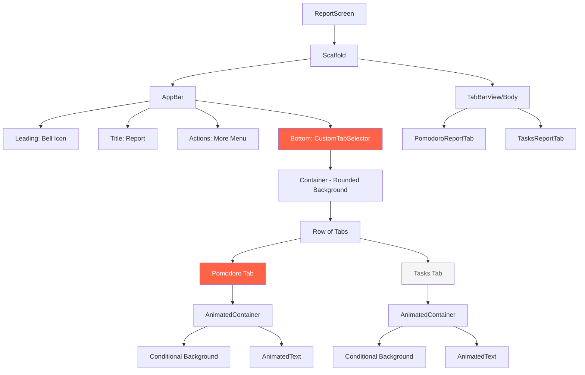

# Kế hoạch Thiết kế lại Header Report Screen

## 📋 Tổng quan

Thiết kế lại phần header của màn hình Report để phù hợp với hình ảnh mẫu, bao gồm:
- Thay icon đồng hồ thành icon chuông
- Đồng bộ kích thước chữ "Report" với "Moji Focus" ở màn hình Manager Task
- Thiết kế lại tab selector (Pomodoro/Tasks) với màu nền

## 🎯 Phân tích Thiết kế Hiện tại

### Report Screen (report_screen.dart)
```dart
// AppBar hiện tại
AppBar(
  title: Text('Report', style: titleLarge?.copyWith(fontWeight: FontWeight.bold)),
  centerTitle: true,
  actions: [IconButton(icon: Icon(Icons.more_vert))],
  bottom: TabBar(
    indicatorColor: primary,
    tabs: [Tab(text: 'Pomodoro'), Tab(text: 'Tasks')]
  )
)
```

**Vấn đề:**
- ❌ Không có icon chuông
- ❌ Font size không đồng bộ với Manager Task
- ❌ Tab không có background color
- ❌ Thiết kế tab đơn giản, chỉ có indicator line

### Manager Task Screen (task_manage_screen.dart)
```dart
// AppBar tham khảo
AppBar(
  leading: Icon(Icons.notifications_outlined, size: 22-26),
  title: Text('Moji Focus', 
    fontSize: 18-20,
    fontWeight: FontWeight.w600,
    letterSpacing: 0.5
  ),
  centerTitle: true,
  actions: [PopupMenuButton(icon: Icons.more_vert)]
)
```

**Đặc điểm:**
- ✅ Icon chuông ở bên trái
- ✅ Font size responsive (18-20px)
- ✅ Font weight w600
- ✅ Letter spacing 0.5

## 🎨 Thiết kế Mới Theo Hình Ảnh

### 1. AppBar Structure

```
┌─────────────────────────────────────┐
│  🔔    Report              ⋮       │
└─────────────────────────────────────┘
```

**Chi tiết:**
- **Icon chuông (trái)**: `Icons.notifications_outlined`
  - Size: 22-26px (responsive)
  - Color: Theme icon color
  - Padding: left screenWidth * 0.05

- **Title "Report" (giữa)**:
  - Font: Urbanist
  - Size: 18-20px (responsive như Moji Focus)
  - Weight: FontWeight.w600
  - Letter spacing: 0.5
  - Color: Theme text color

- **Icon more (phải)**:
  - `Icons.more_vert`
  - Size: 22-26px (responsive)
  - Padding: right screenWidth * 0.05

### 2. Tab Selector Design

Theo hình ảnh, tab selector có thiết kế đặc biệt:

```
┌──────────────────────────────────────────┐
│  ┌──────────────┐  ┌──────────────┐     │
│  │  Pomodoro   │  │    Tasks     │     │
│  │  [ACTIVE]   │  │  [INACTIVE]  │     │
│  └──────────────┘  └──────────────┘     │
└──────────────────────────────────────────┘
```

**Đặc điểm:**
- **Container**:
  - Margin: horizontal 24px (screenPadding)
  - Padding: 4px
  - Background: Light grey / Dark surface
  - Border radius: 20px (rounded pill shape)
  - Height: ~48px

- **Active Tab**:
  - Background: Primary color (#FF6347)
  - Text color: White
  - Border radius: 18px (inner radius)
  - Font weight: Bold/SemiBold

- **Inactive Tab**:
  - Background: Transparent
  - Text color: Grey/Secondary text
  - Border radius: 18px
  - Font weight: Normal/Medium

## 📐 Implementation Plan

### Bước 1: Tạo Custom Tab Selector Widget

Tạo file mới: `lib/features/report/presentation/widgets/custom_tab_selector.dart`

```dart
class CustomTabSelector extends StatelessWidget {
  final int selectedIndex;
  final Function(int) onTabSelected;
  final List<String> tabs;
  
  // Build container với rounded background
  // Build tabs với conditional styling
  // Handle tap events
}
```

**Features:**
- Container với border radius 20px
- Animated tab switching
- Responsive sizing
- Theme support (light/dark)

### Bước 2: Cập nhật Report Screen AppBar

Sửa file: `lib/features/report/presentation/report_screen.dart`

**Thay đổi:**
1. Thêm leading icon (chuông)
2. Cập nhật title style
3. Responsive font sizing
4. Thay TabBar bằng CustomTabSelector

### Bước 3: Xử lý Tab Navigation

- Sử dụng `ValueNotifier<int>` hoặc state management
- Kết nối với TabBarView hoặc IndexedStack
- Animate transitions

## 🔧 Technical Details

### Dependencies
```yaml
# Không cần thêm dependencies mới
# Sử dụng Material widgets có sẵn
```

### Theme Integration
```dart
// Sử dụng design tokens có sẵn
- FigmaColors.primary (#FF6347)
- FigmaColors.surface
- FigmaTextStyles.labelMedium
- FigmaSpacing.screenPadding
- FigmaSpacing.radiusXl (24px)
```

### Responsive Design
```dart
final screenWidth = MediaQuery.of(context).size.width;
final iconSize = screenWidth < 360 ? 22.0 : 26.0;
final titleSize = screenWidth < 360 ? 18.0 : 20.0;
```

## 📱 Layout Specifications

### AppBar
- Height: 56px (default) + TabBar height
- Background: Scaffold background
- Elevation: 0
- Leading width: screenWidth * 0.15

### Custom Tab Container
- Height: 48px
- Margin: horizontal 24px, vertical 8px
- Padding: 4px all around
- Border radius: 20px
- Background: 
  - Light: `Color(0xFFF5F5F5)` (light grey)
  - Dark: `FigmaColors.darkSurface`

### Individual Tab
- Flex: 1 (equal width)
- Height: 40px (container height - padding)
- Border radius: 18px
- Padding: horizontal 16px
- Text alignment: center

## 🎭 Animation & Interaction

### Tab Switch Animation
```dart
AnimatedContainer(
  duration: Duration(milliseconds: 200),
  curve: Curves.easeInOut,
  decoration: BoxDecoration(
    color: isSelected ? primary : transparent,
    borderRadius: BorderRadius.circular(18),
  ),
)
```

### Text Color Animation
```dart
AnimatedDefaultTextStyle(
  duration: Duration(milliseconds: 200),
  style: TextStyle(
    color: isSelected ? white : grey,
    fontWeight: isSelected ? w600 : w500,
  ),
)
```

## ✅ Checklist Triển khai

### Phase 1: Chuẩn bị
- [ ] Tạo file custom_tab_selector.dart
- [ ] Import dependencies cần thiết
- [ ] Setup theme colors và text styles

### Phase 2: Build Custom Tab Selector
- [ ] Build container wrapper
- [ ] Build individual tab items
- [ ] Implement tap handlers
- [ ] Add animations
- [ ] Test responsive sizing

### Phase 3: Cập nhật Report Screen
- [ ] Thêm leading icon (chuông)
- [ ] Cập nhật title style và sizing
- [ ] Thay thế TabBar bằng CustomTabSelector
- [ ] Kết nối tab selection với TabBarView
- [ ] Test navigation flow

### Phase 4: Polish & Testing
- [ ] Test trên nhiều kích thước màn hình
- [ ] Test light/dark theme
- [ ] Verify animations smooth
- [ ] Check accessibility
- [ ] Code review và cleanup

## 🎨 Mermaid Diagram - Component Structure



## 📝 Code Examples

### Custom Tab Selector Usage
```dart
// Trong report_screen.dart
class _ReportScreenState extends State<ReportScreen> {
  int _selectedTabIndex = 0;
  
  @override
  Widget build(BuildContext context) {
    return Scaffold(
      appBar: AppBar(
        leading: Icon(Icons.notifications_outlined),
        title: Text('Report', style: ...),
        bottom: PreferredSize(
          preferredSize: Size.fromHeight(60),
          child: CustomTabSelector(
            selectedIndex: _selectedTabIndex,
            tabs: ['Pomodoro', 'Tasks'],
            onTabSelected: (index) {
              setState(() => _selectedTabIndex = index);
            },
          ),
        ),
      ),
      body: IndexedStack(
        index: _selectedTabIndex,
        children: [
          PomodoroReportTab(),
          TasksReportTab(),
        ],
      ),
    );
  }
}
```

## 🎯 Expected Results

Sau khi hoàn thành:
1. ✅ Icon chuông xuất hiện bên trái header
2. ✅ Chữ "Report" có cùng kích thước với "Moji Focus" (18-20px)
3. ✅ Tab selector có background color và rounded corners
4. ✅ Active tab có màu primary (#FF6347)
5. ✅ Smooth animations khi switch tabs
6. ✅ Responsive trên mọi kích thước màn hình
7. ✅ Support cả light và dark theme

## 🔍 Notes

- Giữ nguyên logic của TabBarView để không ảnh hưởng đến performance
- Custom tab selector chỉ là UI wrapper, logic navigation vẫn giữ nguyên
- Đảm bảo accessibility: semantic labels, tap targets >= 48x48
- Test kỹ trên cả Android và iOS