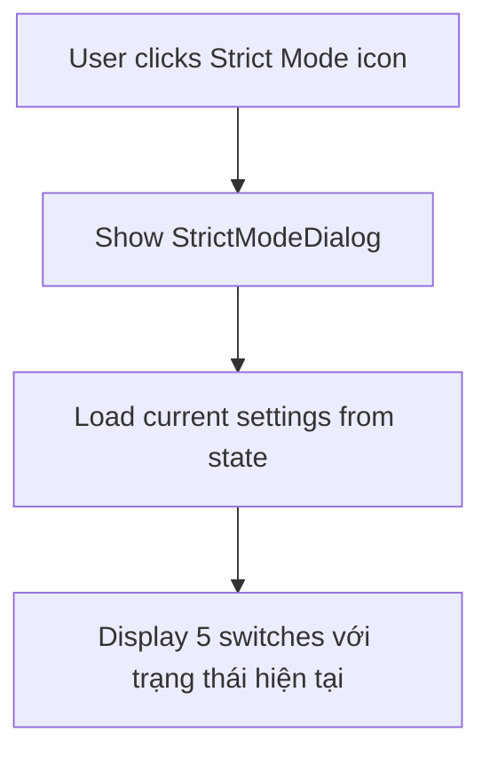
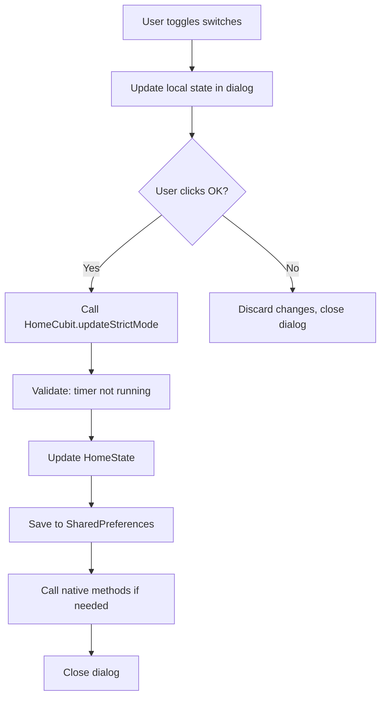
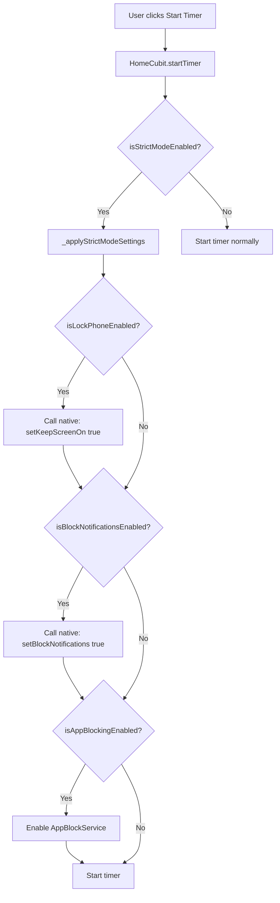
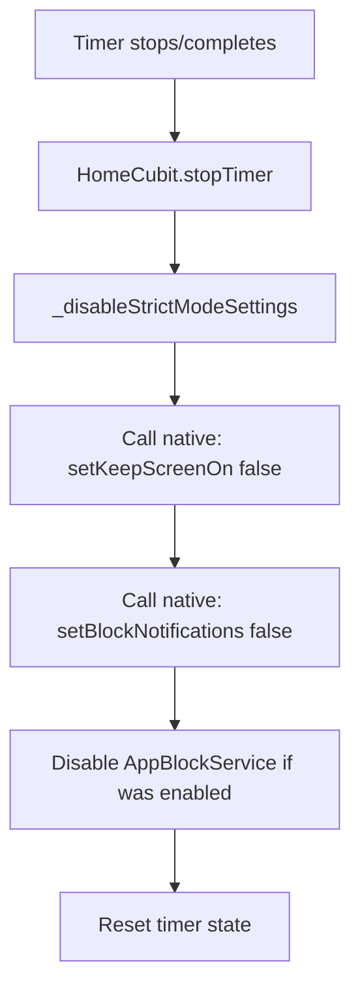

# Kế Hoạch Triển Khai Strict Mode Dialog

## Tổng Quan
Nâng cấp chức năng Strict Mode từ dialog đơn giản hiện tại thành dialog đầy đủ chức năng theo Figma design với 5 tùy chọn:
1. **Block All Notifications** - Chặn tất cả thông báo hệ thống
2. **Block Phone Calls** - Chặn cuộc gọi đến (nếu khả thi)
3. **Block Other Apps** - Chặn các ứng dụng khác
4. **Lock Phone** - Giữ màn hình bật
5. **Prohibit to Exit** - Không cho thoát app

## Phân Tích Kiến Trúc

### 1. State Management
**File cần sửa:** [`lib/features/home/domain/home_state.dart`](lib/features/home/domain/home_state.dart)

#### Thêm các field mới:
```dart
// Strict Mode Settings
final bool isBlockNotificationsEnabled;     // NEW - Block All Notifications
final bool isBlockPhoneCallsEnabled;        // NEW - Block Phone Calls  
// final bool isAppBlockingEnabled;          // ĐÃ CÓ - Block Other Apps
final bool isLockPhoneEnabled;              // NEW - Lock Phone (keep screen on)
// final bool isExitBlockingEnabled;         // ĐÃ CÓ - Prohibit to Exit
```

#### Logic tính toán [`isStrictModeEnabled`](lib/features/home/domain/home_state.dart):
```dart
bool get isStrictModeEnabled => 
    isBlockNotificationsEnabled || 
    isBlockPhoneCallsEnabled || 
    isAppBlockingEnabled || 
    isLockPhoneEnabled || 
    isExitBlockingEnabled;
```

### 2. UI Component
**File mới:** `lib/features/home/presentation/widgets/strict_mode_dialog.dart`

#### Design Specifications (theo Figma):
- **Container**: White background với rounded corners (16-20px)
- **Title**: "Strict Mode" - [`FigmaTextStyles.h4`](lib/core/themes/design_tokens.dart)
- **Switches**: 5 custom switches với màu [`FigmaColors.primary`](lib/core/themes/design_tokens.dart) (#FF6347)
- **Buttons**: 
  - Cancel: Outlined button với màu nhạt
  - OK: Filled button với [`FigmaColors.primary`](lib/core/themes/design_tokens.dart)

#### Component Structure:
```
StrictModeDialog
├── Header (Title)
├── Settings List
│   ├── StrictModeSwitchTile (Block All Notifications)
│   ├── StrictModeSwitchTile (Block Phone Calls)
│   ├── StrictModeSwitchTile (Block Other Apps)
│   ├── StrictModeSwitchTile (Lock Phone)
│   └── StrictModeSwitchTile (Prohibit to Exit)
└── Action Buttons
    ├── Cancel Button
    └── OK Button
```

### 3. Business Logic
**File cần sửa:** [`lib/features/home/domain/home_cubit.dart`](lib/features/home/domain/home_cubit.dart)

#### Methods cần thêm/sửa:
```dart
// UPDATE: Mở rộng method hiện có
void updateStrictMode({
  bool? isBlockNotificationsEnabled,
  bool? isBlockPhoneCallsEnabled,
  bool? isAppBlockingEnabled,
  bool? isLockPhoneEnabled,
  bool? isExitBlockingEnabled,
}) {
  // Validation: Không cho thay đổi khi timer đang chạy
  if (state.isTimerRunning && !state.isPaused) {
    return;
  }
  
  // Update state
  // Call native methods nếu cần
  // Save to SharedPreferences
}

// NEW: Áp dụng Strict Mode khi timer start
void _applyStrictModeSettings() {
  if (state.isBlockNotificationsEnabled) {
    // Native call to block notifications
  }
  if (state.isLockPhoneEnabled) {
    // Native call to keep screen on
  }
  // ...
}

// NEW: Tắt Strict Mode khi timer stop
void _disableStrictModeSettings() {
  // Restore normal state
}
```

### 4. Native Implementation (Android)

#### A. Block Notifications
**File:** [`android/app/src/main/kotlin/MainActivity.kt`](android/app/src/main/kotlin/MainActivity.kt)

**Phương pháp:**
- Sử dụng `NotificationListenerService` (yêu cầu permission đặc biệt)
- Hoặc đơn giản hơn: Set app notification priority cao để che notifications khác

**Method Channel:**
```kotlin
"setBlockNotifications" -> {
    val enabled = call.argument<Boolean>("enabled") ?: false
    // Implementation
    result.success(true)
}
```

#### B. Block Phone Calls
**Phân tích:** Chức năng này RẤT phức tạp và cần:
- `READ_PHONE_STATE` permission
- `CALL_PHONE` permission (Android 10+)
- Có thể vi phạm chính sách của Google Play

**Quyết định:** BỎ QUA hoặc implement ở giai đoạn sau. Trong dialog sẽ disable switch này và hiển thị tooltip "Tính năng đang phát triển"

#### C. Lock Phone (Keep Screen On)
**File:** [`android/app/src/main/kotlin/TimerService.kt`](android/app/src/main/kotlin/TimerService.kt)

**Implementation:**
```kotlin
private var wakeLock: PowerManager.WakeLock? = null

fun enableKeepScreenOn() {
    val powerManager = getSystemService(Context.POWER_SERVICE) as PowerManager
    wakeLock = powerManager.newWakeLock(
        PowerManager.SCREEN_DIM_WAKE_LOCK or PowerManager.ACQUIRE_CAUSES_WAKEUP,
        "MojiFocus::KeepScreenOn"
    )
    wakeLock?.acquire()
}

fun disableKeepScreenOn() {
    wakeLock?.release()
    wakeLock = null
}
```

**Method Channel:**
```kotlin
"setKeepScreenOn" -> {
    val enabled = call.argument<Boolean>("enabled") ?: false
    if (enabled) {
        enableKeepScreenOn()
    } else {
        disableKeepScreenOn()
    }
    result.success(true)
}
```

#### D. Block Other Apps
**Đã có sẵn:** [`AppBlockService`](android/app/src/main/kotlin/AppBlockService.kt) - Accessibility Service
- Chỉ cần kết nối với UI mới

#### E. Prohibit to Exit
**Đã có sẵn:** Logic trong [`WillPopScope`](lib/features/home/presentation/home_screen.dart:103-127)
- Chỉ cần kết nối với state mới

### 5. Permissions Required

**AndroidManifest.xml additions:**
```xml
<!-- Already exists -->
<uses-permission android:name="android.permission.POST_NOTIFICATIONS" />
<uses-permission android:name="android.permission.FOREGROUND_SERVICE" />
<uses-permission android:name="android.permission.REQUEST_IGNORE_BATTERY_OPTIMIZATIONS" />

<!-- May need to add -->
<uses-permission android:name="android.permission.WAKE_LOCK" />
```

### 6. SharedPreferences Keys

**File:** [`lib/features/home/domain/home_cubit.dart`](lib/features/home/domain/home_cubit.dart)

```dart
const String prefBlockNotifications = "blockNotifications";
const String prefBlockPhoneCalls = "blockPhoneCalls"; 
const String prefLockPhone = "lockPhone";
// Đã có: isAppBlockingEnabled, isExitBlockingEnabled
```

## Luồng Hoạt Động

### 1. User Opens Strict Mode Dialog


### 2. User Modifies Settings


### 3. Timer Start - Apply Strict Mode


### 4. Timer Stop - Disable Strict Mode


## Implementation Steps

### Phase 1: State & Data Layer
- [ ] Update [`HomeState`](lib/features/home/domain/home_state.dart) với 3 field mới
- [ ] Update [`HomeState.copyWith()`](lib/features/home/domain/home_state.dart:56-112)
- [ ] Update [`HomeState.props`](lib/features/home/domain/home_state.dart:114-140)
- [ ] Thêm SharedPreferences keys trong [`HomeCubit`](lib/features/home/domain/home_cubit.dart)

### Phase 2: UI Layer
- [ ] Tạo file `lib/features/home/presentation/widgets/strict_mode_dialog.dart`
- [ ] Implement `StrictModeDialog` widget với design theo Figma
- [ ] Implement `StrictModeSwitchTile` widget custom
- [ ] Implement action buttons (Cancel, OK)

### Phase 3: Business Logic
- [ ] Update [`HomeCubit.updateStrictMode()`](lib/features/home/domain/home_cubit.dart:552-585)
- [ ] Implement `_applyStrictModeSettings()` trong [`HomeCubit`](lib/features/home/domain/home_cubit.dart)
- [ ] Implement `_disableStrictModeSettings()` trong [`HomeCubit`](lib/features/home/domain/home_cubit.dart)
- [ ] Update [`HomeCubit.startTimer()`](lib/features/home/domain/home_cubit.dart:412-459) để call `_applyStrictModeSettings()`
- [ ] Update [`HomeCubit.stopTimer()`](lib/features/home/domain/home_cubit.dart:518-542) để call `_disableStrictModeSettings()`
- [ ] Implement load/save settings từ SharedPreferences

### Phase 4: Native Implementation (Android)
- [ ] Thêm WakeLock implementation trong [`TimerService.kt`](android/app/src/main/kotlin/TimerService.kt)
- [ ] Thêm method channel "setKeepScreenOn" trong [`MainActivity.kt`](android/app/src/main/kotlin/MainActivity.kt)
- [ ] (Optional) Thêm NotificationListener cho Block Notifications
- [ ] Thêm WAKE_LOCK permission vào [`AndroidManifest.xml`](android/app/src/main/AndroidManifest.xml) nếu chưa có

### Phase 5: Integration
- [ ] Update [`_showStrictModeDialog()`](lib/features/home/presentation/home_screen.dart:668-713) để sử dụng `StrictModeDialog` mới
- [ ] Test tất cả các flows
- [ ] Kiểm tra state persistence khi app restart
- [ ] Kiểm tra behavior khi timer running

### Phase 6: Polish & Error Handling
- [ ] Thêm loading states nếu cần
- [ ] Thêm error messages cho native calls
- [ ] Thêm tooltips/hints cho các switch
- [ ] Disable "Block Phone Calls" switch với message "Coming soon"
- [ ] Thêm confirmation dialog nếu user bật nhiều strict options

## Technical Decisions

### 1. Block Phone Calls
**Quyết định:** KHÔNG implement trong version này
**Lý do:**
- Rất phức tạp, cần nhiều permissions
- Có thể vi phạm Google Play policies
- Ít practical hơn các options khác

**Giải pháp:** Hiển thị switch nhưng disabled với tooltip "Tính năng đang phát triển"

### 2. Block Notifications
**Quyết định:** Implement đơn giản trước
**Approach 1 (Đơn giản):**
- Không thực sự block system notifications
- Chỉ hiển thị full-screen timer overlay
- Set notification priority cao cho app

**Approach 2 (Phức tạp - sau này):**
- Sử dụng NotificationListenerService
- Yêu cầu permission đặc biệt
- Cancel notifications của apps khác

**Chọn:** Approach 1 cho version đầu

### 3. Keep Screen On
**Quyết định:** Implement đầy đủ
**Lý do:**
- Đơn giản, chỉ cần WakeLock
- Permission không nhạy cảm
- Very useful feature

### 4. State Persistence
**Quyết định:** Lưu tất cả settings vào SharedPreferences
**Lý do:**
- User không muốn setting lại mỗi lần
- Consistent với cách app lưu state khác

## Risk & Mitigation

### Risks:
1. **Battery drain** từ WakeLock
   - Mitigation: Chỉ active khi timer running
   
2. **User frustration** nếu strict mode quá nghiêm
   - Mitigation: Clear explanations, easy to disable

3. **Permission denials**
   - Mitigation: Graceful degradation, clear messages

4. **Conflicts với existing features**
   - Mitigation: Careful testing, sequential implementation

## Testing Checklist

### Functional Tests:
- [ ] Mở Strict Mode dialog - hiển thị đúng settings
- [ ] Toggle từng switch - state update chính xác
- [ ] Click OK - settings được lưu
- [ ] Click Cancel - không lưu changes
- [ ] Start timer với strict mode ON - tất cả features hoạt động
- [ ] Start timer với strict mode OFF - normal behavior
- [ ] Stop timer - strict mode features disabled
- [ ] App restart - settings được restore

### Edge Cases:
- [ ] Thay đổi settings khi timer running - bị block
- [ ] Permission denied - app vẫn hoạt động
- [ ] Battery optimization active - warning message
- [ ] Accessibility service disabled - block apps không work

### UI/UX Tests:
- [ ] Dialog design match Figma
- [ ] Animations smooth
- [ ] Touch targets đủ lớn
- [ ] Text readable, clear
- [ ] Error states friendly

## Timeline Estimate

**Không cung cấp timeline theo yêu cầu của user**

## Dependencies

### Flutter Packages:
- `shared_preferences` - ĐÃ CÓ
- `flutter_bloc` - ĐÃ CÓ
- Không cần thêm package mới

### Native Dependencies:
- Android API 23+ (M) cho WakeLock
- Accessibility Service - ĐÃ CÓ

## Notes

- Design tokens từ [`FigmaColors`](lib/core/themes/design_tokens.dart) và [`FigmaTextStyles`](lib/core/themes/design_tokens.dart) phải được sử dụng nhất quán
- Tất cả text phải bằng Tiếng Việt
- Cần maintain backward compatibility với existing state
- Native code chỉ cho Android (iOS không trong scope)