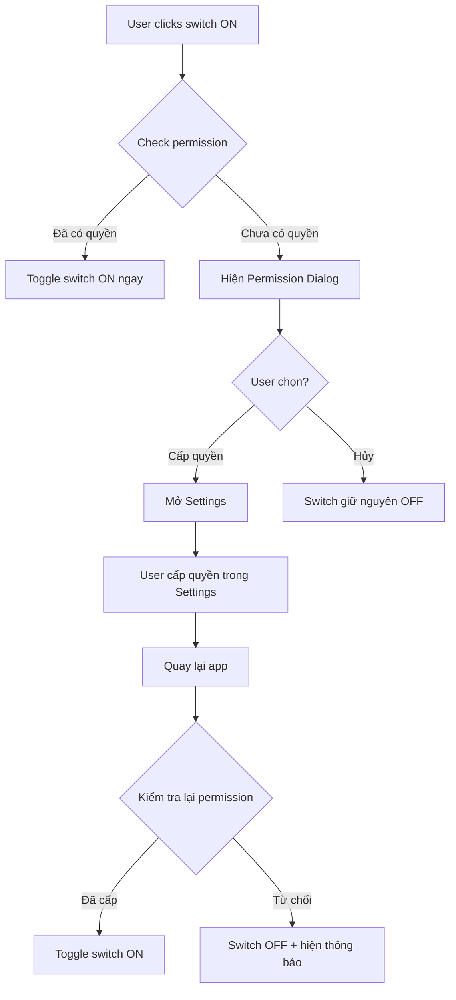

# Kế Hoạch Xử Lý Permission Cho Strict Mode

## Tổng Quan

Cải thiện UX khi người dùng bật các tính năng Strict Mode cần quyền đặc biệt. Implement flow "Popup khi toggle + disable switch nếu không có quyền" để đảm bảo trải nghiệm người dùng mượt mà và rõ ràng.

## Phân Tích Vấn Đề Hiện Tại

### Tính Năng Strict Mode và Permissions Cần Thiết

| Tính năng | Permission cần | Status hiện tại | Native API |
|-----------|---------------|-----------------|------------|
| **Chặn thông báo** | Do Not Disturb (DND) Access | ✅ Đã có check/request | [`NotificationManager.isNotificationPolicyAccessGranted`](android/app/src/main/kotlin/MainActivity.kt:134) |
| **Chặn cuộc gọi** | READ_PHONE_STATE, CALL_PHONE | ❌ Không implement | N/A (postponed) |
| **Chặn ứng dụng khác** | Accessibility Service | ✅ Đã có check/request | [`isAccessibilityServiceEnabled()`](android/app/src/main/kotlin/MainActivity.kt:538) |
| **Giữ màn hình sáng** | WAKE_LOCK | ✅ Không cần runtime permission | Dangerous permission auto-granted |
| **Cấm thoát ứng dụng** | Không cần permission | ✅ OK | Pure Flutter logic |

### Vấn Đề Hiện Tại

1. **Trong [`StrictModeDialog`](lib/features/home/presentation/widgets/strict_mode_dialog.dart:68-98)**:
   - User có thể toggle bất kỳ switch nào
   - KHÔNG có kiểm tra permission trước khi toggle
   - KHÔNG có thông báo nếu thiếu permission
   
2. **Trong [`HomeCubit._applyStrictModeSettings()`](lib/features/home/domain/home_cubit.dart:830-863)**:
   - Chỉ kiểm tra permission KHI START TIMER
   - Nếu thiếu permission, tự động request nhưng user không biết tại sao
   - Không có feedback nếu user từ chối permission

3. **User Experience hiện tại**:
   ```
   User bật "Chặn thông báo" → Nhấn Lưu → OK
   → Bấm Start Timer → Bị đưa đến Settings (không rõ lý do)
   → Quay lại app → Timer không chặn thông báo (nếu từ chối)
   ```

## Giải Pháp: Permission-Aware UI Flow

### Flow Mới



### UI Components Cần Thêm

#### 1. Permission Request Dialog
```dart
class PermissionRequestDialog extends StatelessWidget {
  final String featureName;
  final String permissionName;
  final VoidCallback onGrantPermission;
  final VoidCallback onCancel;
  
  // Example:
  // featureName: "Chặn thông báo"
  // permissionName: "Do Not Disturb"
}
```

**Design Specifications:**
- Title: "Cần cấp quyền"
- Body: "Để sử dụng tính năng **[featureName]**, bạn cần cấp quyền **[permissionName]** cho ứng dụng.\n\nBạn có muốn mở cài đặt để cấp quyền?"
- Buttons:
  - "Hủy" - TextButton (secondary)
  - "Mở cài đặt" - ElevatedButton (primary)

#### 2. Permission Status Indicator

Thêm icon trạng thái cho mỗi switch tile:
```dart
Widget _buildSwitchTile({
  required String title,
  required bool value,
  required ValueChanged<bool>? onChanged,
  String? subtitle,
  bool requiresPermission = false,  // NEW
  bool hasPermission = true,        // NEW
}) {
  // Show warning icon nếu requiresPermission && !hasPermission
}
```

**Icons:**
- ✅ Không cần permission hoặc đã có permission: Không hiện gì
- ⚠️ Cần permission nhưng chưa có: Icon warning màu vàng
- 🔒 Permission bị từ chối vĩnh viễn: Icon lock màu đỏ

## Implementation Plan

### Phase 1: State Management

**File: [`lib/features/home/domain/home_state.dart`](lib/features/home/domain/home_state.dart)**

Thêm fields để track permission states:

```dart
class HomeState extends Equatable {
  // ... existing fields ...
  
  // NEW: Permission states
  final bool hasDNDPermission;           // For Block Notifications
  final bool hasAccessibilityPermission; // For Block Other Apps
  
  const HomeState({
    // ... existing params ...
    this.hasDNDPermission = false,
    this.hasAccessibilityPermission = false,
  });
}
```

### Phase 2: Permission Service

**File mới: `lib/core/services/permission_service.dart`**

Tạo service để quản lý tất cả permission checks:

```dart
import 'package:flutter/services.dart';

class PermissionService {
  static const MethodChannel _channel = 
      MethodChannel('com.example.moji_todo/permissions');
  
  /// Check DND permission for Block Notifications feature
  Future<bool> checkDNDPermission() async {
    try {
      final result = await _channel.invokeMethod<bool>('checkDNDPermission');
      return result ?? false;
    } catch (e) {
      return false;
    }
  }
  
  /// Request DND permission
  Future<void> requestDNDPermission() async {
    try {
      await _channel.invokeMethod('requestDNDPermission');
    } catch (e) {
      print('Error requesting DND permission: $e');
    }
  }
  
  /// Check Accessibility Service for Block Other Apps feature
  Future<bool> checkAccessibilityPermission() async {
    try {
      final result = await _channel.invokeMethod<bool>(
        'isAccessibilityPermissionEnabled'
      );
      return result ?? false;
    } catch (e) {
      return false;
    }
  }
  
  /// Request Accessibility permission
  Future<void> requestAccessibilityPermission() async {
    try {
      await _channel.invokeMethod('requestAccessibilityPermission');
    } catch (e) {
      print('Error requesting Accessibility permission: $e');
    }
  }
}
```

### Phase 3: HomeCubit Updates

**File: [`lib/features/home/domain/home_cubit.dart`](lib/features/home/domain/home_cubit.dart)**

#### A. Thêm PermissionService

```dart
class HomeCubit extends Cubit<HomeState> {
  // ... existing fields ...
  final PermissionService _permissionService = PermissionService();
  
  // ... rest of code ...
}
```

#### B. Load permission states khi init

```dart
Future<void> _initialize() async {
  // ... existing init code ...
  
  // NEW: Load permission states
  final hasDND = await _permissionService.checkDNDPermission();
  final hasAccessibility = await _permissionService.checkAccessibilityPermission();
  
  emit(state.copyWith(
    // ... existing params ...
    hasDNDPermission: hasDND,
    hasAccessibilityPermission: hasAccessibility,
  ));
}
```

#### C. Method kiểm tra permission trước khi enable feature

```dart
/// Check and request permission for a specific strict mode feature
/// Returns true if permission is granted or not needed
Future<bool> checkAndRequestPermissionFor(StrictModeFeature feature) async {
  switch (feature) {
    case StrictModeFeature.blockNotifications:
      if (state.hasDNDPermission) return true;
      
      // Request permission
      await _permissionService.requestDNDPermission();
      
      // Re-check after request (user might have granted it)
      final hasPermission = await _permissionService.checkDNDPermission();
      emit(state.copyWith(hasDNDPermission: hasPermission));
      return hasPermission;
      
    case StrictModeFeature.blockOtherApps:
      if (state.hasAccessibilityPermission) return true;
      
      await _permissionService.requestAccessibilityPermission();
      
      final hasPermission = await _permissionService.checkAccessibilityPermission();
      emit(state.copyWith(hasAccessibilityPermission: hasPermission));
      return hasPermission;
      
    case StrictModeFeature.lockPhone:
    case StrictModeFeature.prohibitExit:
      // These don't need runtime permissions
      return true;
      
    case StrictModeFeature.blockPhoneCalls:
      // Not implemented yet
      return false;
  }
}

/// Refresh all permission states (call when app resumes)
Future<void> refreshPermissionStates() async {
  final hasDND = await _permissionService.checkDNDPermission();
  final hasAccessibility = await _permissionService.checkAccessibilityPermission();
  
  emit(state.copyWith(
    hasDNDPermission: hasDND,
    hasAccessibilityPermission: hasAccessibility,
  ));
}
```

#### D. Enum cho Strict Mode Features

```dart
enum StrictModeFeature {
  blockNotifications,
  blockPhoneCalls,
  blockOtherApps,
  lockPhone,
  prohibitExit,
}
```

### Phase 4: StrictModeDialog Updates

**File: [`lib/features/home/presentation/widgets/strict_mode_dialog.dart`](lib/features/home/presentation/widgets/strict_mode_dialog.dart)**

#### A. Permission Request Dialog Component

```dart
/// Dialog yêu cầu cấp quyền
class _PermissionRequestDialog extends StatelessWidget {
  final String featureName;
  final String permissionName;
  final VoidCallback onGrantPermission;
  final VoidCallback onCancel;

  const _PermissionRequestDialog({
    required this.featureName,
    required this.permissionName,
    required this.onGrantPermission,
    required this.onCancel,
  });

  @override
  Widget build(BuildContext context) {
    return AlertDialog(
      shape: RoundedRectangleBorder(
        borderRadius: BorderRadius.circular(FigmaSpacing.radiusLg),
      ),
      backgroundColor: FigmaColors.white,
      title: Row(
        children: [
          Icon(Icons.security, color: FigmaColors.warning, size: 24),
          const SizedBox(width: 8),
          Text(
            'Cần cấp quyền',
            style: FigmaTextStyles.h4.copyWith(color: FigmaColors.textPrimary),
          ),
        ],
      ),
      content: Text(
        'Để sử dụng tính năng "$featureName", bạn cần cấp quyền "$permissionName" cho ứng dụng.\n\nBạn có muốn mở cài đặt để cấp quyền?',
        style: FigmaTextStyles.bodyMedium.copyWith(
          color: FigmaColors.textSecondary,
        ),
      ),
      actions: [
        TextButton(
          onPressed: onCancel,
          child: Text(
            'Hủy',
            style: FigmaTextStyles.labelMedium.copyWith(
              color: FigmaColors.textSecondary,
            ),
          ),
        ),
        ElevatedButton(
          onPressed: onGrantPermission,
          style: ElevatedButton.styleFrom(
            backgroundColor: FigmaColors.primary,
            foregroundColor: FigmaColors.white,
            shape: RoundedRectangleBorder(
              borderRadius: BorderRadius.circular(FigmaSpacing.radiusMd),
            ),
          ),
          child: Text(
            'Mở cài đặt',
            style: FigmaTextStyles.labelMedium.copyWith(
              color: FigmaColors.white,
            ),
          ),
        ),
      ],
    );
  }
}
```

#### B. Update _buildSwitchTile để hỗ trợ permission

```dart
Widget _buildSwitchTile({
  required String title,
  required bool value,
  required ValueChanged<bool>? onChanged,
  String? subtitle,
  bool requiresPermission = false,
  bool hasPermission = true,
}) {
  final isEnabled = onChanged != null;
  final showWarning = requiresPermission && !hasPermission;

  return Padding(
    padding: const EdgeInsets.only(bottom: FigmaSpacing.sm),
    child: Row(
      children: [
        Expanded(
          child: Column(
            crossAxisAlignment: CrossAxisAlignment.start,
            children: [
              Row(
                children: [
                  Text(
                    title,
                    style: FigmaTextStyles.bodyMedium.copyWith(
                      fontSize: 16,
                      color: isEnabled
                          ? FigmaColors.textPrimary
                          : FigmaColors.textSecondary,
                    ),
                  ),
                  if (showWarning) ...[
                    const SizedBox(width: 4),
                    Icon(
                      Icons.warning_amber_rounded,
                      size: 16,
                      color: FigmaColors.warning,
                    ),
                  ],
                ],
              ),
              if (subtitle != null) ...[
                const SizedBox(height: 2),
                Text(
                  subtitle,
                  style: FigmaTextStyles.bodySmall.copyWith(
                    color: showWarning 
                        ? FigmaColors.warning 
                        : FigmaColors.textTertiary,
                  ),
                ),
              ],
            ],
          ),
        ),
        const SizedBox(width: FigmaSpacing.md),
        Transform.scale(
          scale: 0.9,
          child: Switch(
            value: value,
            onChanged: onChanged,
            activeColor: FigmaColors.primary,
            activeTrackColor: FigmaColors.primary.withOpacity(0.5),
            inactiveThumbColor: Colors.grey.shade400,
            inactiveTrackColor: Colors.grey.shade300,
          ),
        ),
      ],
    ),
  );
}
```

#### C. Update onChanged handlers với permission check

```dart
class _StrictModeDialogState extends State<StrictModeDialog> {
  // ... existing fields ...
  
  /// Handle toggle with permission check
  Future<void> _handleToggle({
    required bool newValue,
    required StrictModeFeature feature,
    required ValueChanged<bool> onSuccess,
  }) async {
    if (!newValue) {
      // Turning OFF - no permission needed
      onSuccess(newValue);
      return;
    }
    
    // Turning ON - check permission first
    final homeCubit = context.read<HomeCubit>();
    final hasPermission = await homeCubit.checkAndRequestPermissionFor(feature);
    
    if (!hasPermission && mounted) {
      // Show permission request dialog
      final shouldRequest = await showDialog<bool>(
        context: context,
        builder: (context) => _PermissionRequestDialog(
          featureName: _getFeatureName(feature),
          permissionName: _getPermissionName(feature),
          onGrantPermission: () => Navigator.of(context).pop(true),
          onCancel: () => Navigator.of(context).pop(false),
        ),
      );
      
      if (shouldRequest == true) {
        // User wants to grant permission - request it
        await homeCubit.checkAndRequestPermissionFor(feature);
        
        // Check again after user returns from settings
        // Note: App will resume, refreshPermissionStates will be called
        // For now, just don't toggle the switch
        if (mounted) {
          ScaffoldMessenger.of(context).showSnackBar(
            SnackBar(
              content: Text(
                'Vui lòng cấp quyền trong cài đặt, sau đó quay lại và thử lại',
                style: TextStyle(color: Colors.white),
              ),
              backgroundColor: FigmaColors.warning,
              duration: const Duration(seconds: 3),
            ),
          );
        }
      }
      return; // Don't toggle the switch
    }
    
    // Has permission - proceed
    onSuccess(newValue);
  }
  
  String _getFeatureName(StrictModeFeature feature) {
    switch (feature) {
      case StrictModeFeature.blockNotifications:
        return 'Chặn thông báo';
      case StrictModeFeature.blockOtherApps:
        return 'Chặn ứng dụng khác';
      case StrictModeFeature.blockPhoneCalls:
        return 'Chặn cuộc gọi';
      case StrictModeFeature.lockPhone:
        return 'Giữ màn hình sáng';
      case StrictModeFeature.prohibitExit:
        return 'Cấm thoát ứng dụng';
    }
  }
  
  String _getPermissionName(StrictModeFeature feature) {
    switch (feature) {
      case StrictModeFeature.blockNotifications:
        return 'Do Not Disturb';
      case StrictModeFeature.blockOtherApps:
        return 'Accessibility Service';
      default:
        return 'Unknown';
    }
  }
}
```

#### D. Update build method với permission-aware switches

```dart
@override
Widget build(BuildContext context) {
  final currentState = context.watch<HomeCubit>().state;
  
  return AlertDialog(
    // ... existing dialog setup ...
    content: SingleChildScrollView(
      child: Column(
        mainAxisSize: MainAxisSize.min,
        children: [
          // Block Notifications - REQUIRES PERMISSION
          _buildSwitchTile(
            title: 'Chặn thông báo',
            value: _blockNotifications,
            onChanged: (value) => _handleToggle(
              newValue: value,
              feature: StrictModeFeature.blockNotifications,
              onSuccess: (v) => setState(() => _blockNotifications = v),
            ),
            subtitle: currentState.hasDNDPermission
                ? 'Tắt tất cả thông báo khi tập trung'
                : 'Cần cấp quyền Do Not Disturb',
            requiresPermission: true,
            hasPermission: currentState.hasDNDPermission,
          ),
          
          // Block Phone Calls - DISABLED
          _buildSwitchTile(
            title: 'Chặn cuộc gọi',
            value: _blockPhoneCalls,
            onChanged: null, // Still disabled
            subtitle: 'Tính năng đang phát triển',
          ),
          
          // Block Other Apps - REQUIRES PERMISSION
          _buildSwitchTile(
            title: 'Chặn ứng dụng khác',
            value: _blockOtherApps,
            onChanged: (value) => _handleToggle(
              newValue: value,
              feature: StrictModeFeature.blockOtherApps,
              onSuccess: (v) => setState(() => _blockOtherApps = v),
            ),
            subtitle: currentState.hasAccessibilityPermission
                ? 'Ngăn mở các ứng dụng gây xao nhãng'
                : 'Cần bật Accessibility Service',
            requiresPermission: true,
            hasPermission: currentState.hasAccessibilityPermission,
          ),
          
          // Lock Phone - NO PERMISSION NEEDED
          _buildSwitchTile(
            title: 'Giữ màn hình sáng',
            value: _lockPhone,
            onChanged: (value) => setState(() => _lockPhone = value),
            subtitle: 'Màn hình không tự tắt khi tập trung',
          ),
          
          // Prohibit Exit - NO PERMISSION NEEDED
          _buildSwitchTile(
            title: 'Cấm thoát ứng dụng',
            value: _prohibitExit,
            onChanged: (value) => setState(() => _prohibitExit = value),
            subtitle: 'Không thể thoát khi đang tập trung',
          ),
        ],
      ),
    ),
    // ... existing actions ...
  );
}
```

### Phase 5: App Lifecycle Handling

**File: [`lib/features/home/presentation/home_screen.dart`](lib/features/home/presentation/home_screen.dart)**

Thêm listener để refresh permission states khi app resume:

```dart
class _HomeScreenState extends State<HomeScreen> with WidgetsBindingObserver {
  @override
  void initState() {
    super.initState();
    WidgetsBinding.instance.addObserver(this);
  }
  
  @override
  void dispose() {
    WidgetsBinding.instance.removeObserver(this);
    super.dispose();
  }
  
  @override
  void didChangeAppLifecycleState(AppLifecycleState state) {
    if (state == AppLifecycleState.resumed) {
      // Refresh permission states when user returns from Settings
      context.read<HomeCubit>().refreshPermissionStates();
    }
  }
  
  // ... rest of code ...
}
```

### Phase 6: Improved Error Handling in HomeCubit

**File: [`lib/features/home/domain/home_cubit.dart`](lib/features/home/domain/home_cubit.dart:830-863)**

Update [`_applyStrictModeSettings()`](lib/features/home/domain/home_cubit.dart:830) để handle gracefully:

```dart
void _applyStrictModeSettings() async {
  final shouldApply = state.isStrictModeEnabled && state.isTimerRunning;

  // Keep Screen On (Always works - no runtime permission needed)
  if (state.isLockPhoneEnabled) {
    _serviceChannel.invokeMethod('setKeepScreenOn', {'enabled': shouldApply});
    print('Set Keep Screen On: $shouldApply');
  } else {
    _serviceChannel.invokeMethod('setKeepScreenOn', {'enabled': false});
  }

  // Block Notifications - Only if has permission
  if (state.isBlockNotificationsEnabled && shouldApply) {
    if (state.hasDNDPermission) {
      try {
        await _serviceChannel.invokeMethod('setBlockNotifications', {
          'enabled': true,
        });
        print('Set Block Notifications: true');
      } catch (e) {
        print('Error enabling Block Notifications: $e');
        // Notification will be shown to user via SnackBar in UI layer
      }
    } else {
      print('Cannot enable Block Notifications: Permission not granted');
      // Don't show error here - user was already informed in dialog
    }
  } else {
    _serviceChannel.invokeMethod('setBlockNotifications', {'enabled': false});
    print('Set Block Notifications: false');
  }
  
  // Block Other Apps - Only if has permission
  if (state.isAppBlockingEnabled && shouldApply) {
    if (state.hasAccessibilityPermission) {
      _serviceChannel.invokeMethod('setAppBlockingEnabled', {'enabled': true});
      print('Set App Blocking: true');
    } else {
      print('Cannot enable App Blocking: Accessibility Service not enabled');
    }
  } else if (!state.isAppBlockingEnabled) {
    _serviceChannel.invokeMethod('setAppBlockingEnabled', {'enabled': false});
    print('Set App Blocking: false');
  }
}
```

## Testing Checklist

### Permission Flow Tests

- [ ] **Block Notifications - Có quyền:**
  - Toggle ON → Switch bật ngay
  - Không hiện popup
  - Start timer → DND mode activated
  
- [ ] **Block Notifications - Chưa có quyền:**
  - Toggle ON → Hiện popup "Cần cấp quyền"
  - Click "Hủy" → Switch giữ nguyên OFF
  - Click "Mở cài đặt" → Mở Settings
  - Cấp quyền → Quay lại app → Thử toggle lại → OK
  
- [ ] **Block Notifications - Từ chối quyền:**
  - Toggle ON → Popup → Mở Settings → Từ chối
  - Quay lại app → Switch vẫn OFF
  - Warning icon hiện bên cạnh
  - Subtitle hiện "Cần cấp quyền Do Not Disturb"

- [ ] **Block Other Apps - Có quyền:**
  - Toggle ON → Switch bật ngay
  - Start timer → Apps blocked

- [ ] **Block Other Apps - Chưa có quyền:**
  - Toggle ON → Hiện popup
  - Click "Mở cài đặt" → Mở Accessibility Settings
  - Enable service → Quay lại → Thử lại → OK

- [ ] **Lock Phone & Prohibit Exit:**
  - Toggle ON → Bật ngay (không cần permission)
  - Start timer → Features hoạt động

### App Resume Tests

- [ ] User đang ở Strict Mode dialog → Mở Settings → Cấp quyền → Quay lại → Permission state updated
- [ ] User start timer với feature bị thiếu quyền → Feature không hoạt động (silent fail, no crash)
- [ ] User cấp quyền khi app ở background → Resume app → State refreshed

### Edge Cases

- [ ] Toggle nhiều switches cần permission cùng lúc → Mỗi switch xử lý independent
- [ ] User deny permission vĩnh viễn → App vẫn hoạt động, feature bị disable
- [ ] Permission bị revoke khi timer đang chạy → Timer tiếp tục, feature bị disable
- [ ] App killed và restart → Permission states được restore đúng

## UX Improvements Summary

### Trước (Current)

```
❌ User bật feature → Không biết cần quyền
❌ Click Lưu → Không có warning
❌ Start timer → Đột nhiên mở Settings (confusing!)
❌ Từ chối quyền → Không có feedback
❌ Feature không hoạt động → Không rõ lý do
```

### Sau (New)

```
✅ User bật feature → Kiểm tra quyền ngay lập tức
✅ Thiếu quyền → Popup rõ ràng giải thích
✅ User chọn cấp quyền → Mở Settings với context
✅ Từ chối quyền → Switch giữ OFF, hiện warning icon
✅ Feature không hoạt động → Biết rõ lý do (thiếu quyền)
```

## Files Changed Summary

### New Files
- `lib/core/services/permission_service.dart` - Permission management service

### Modified Files
- [`lib/features/home/domain/home_state.dart`](lib/features/home/domain/home_state.dart) - Add permission state fields
- [`lib/features/home/domain/home_cubit.dart`](lib/features/home/domain/home_cubit.dart) - Add permission methods
- [`lib/features/home/presentation/widgets/strict_mode_dialog.dart`](lib/features/home/presentation/widgets/strict_mode_dialog.dart) - Permission-aware UI
- [`lib/features/home/presentation/home_screen.dart`](lib/features/home/presentation/home_screen.dart) - Add lifecycle observer

### Native Files (No Changes Needed)
- [`android/app/src/main/kotlin/MainActivity.kt`](android/app/src/main/kotlin/MainActivity.kt) - Permission methods đã có sẵn ✅

## Implementation Order

1. **Phase 1**: State Management - Add permission fields to HomeState
2. **Phase 2**: Permission Service - Create reusable permission service
3. **Phase 3**: HomeCubit - Add permission methods and lifecycle handling
4. **Phase 4**: UI Updates - Update StrictModeDialog with permission-aware switches
5. **Phase 5**: App Lifecycle - Add resume handler to refresh permissions
6. **Phase 6**: Error Handling - Improve _applyStrictModeSettings with graceful degradation
7. **Testing**: Comprehensive testing of all flows

## Notes

- Tất cả text phải bằng Tiếng Việt
- Permission request không block UI - async handling
- Graceful degradation nếu permission bị denied
- Clear visual feedback về permission status
- User-friendly error messages
- Không crash app nếu permission bị revoke

## References

- Permission Channel: [`com.example.moji_todo/permissions`](android/app/src/main/kotlin/MainActivity.kt:29)
- DND Check: [`checkDNDPermission`](android/app/src/main/kotlin/MainActivity.kt:131)
- Accessibility Check: [`isAccessibilityPermissionEnabled`](android/app/src/main/kotlin/MainActivity.kt:95)
- Current Strict Mode Dialog: [`strict_mode_dialog.dart`](lib/features/home/presentation/widgets/strict_mode_dialog.dart)