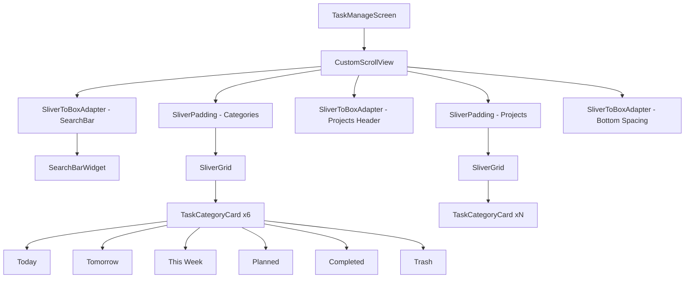
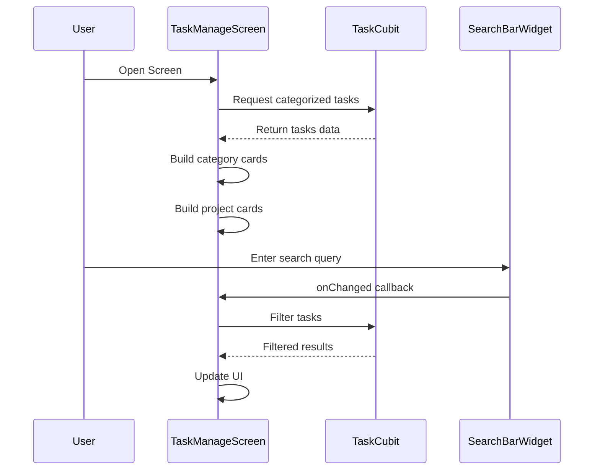

# Kế Hoạch Thiết Kế Lại Task Manager Screen

## 🎯 Mục Tiêu
Thiết kế lại trang Task Manager Screen để khắc phục lỗi overflow và phù hợp với thiết kế Figma mới.

## 📋 Phân Tích Vấn Đề Hiện Tại

### Vấn đề overflow xảy ra ở:
1. **Category Cards GridView** (dòng 124-233 trong `task_manage_screen.dart`)
   - Sử dụng `GridView.count` với `shrinkWrap: true` và `physics: NeverScrollableScrollPhysics()`
   - `childAspectRatio: 2` cố định không responsive với nội dung
   - Khi text trong card dài hoặc có nhiều thông tin, card bị tràn

2. **Project Cards GridView** (dòng 240-302 trong `task_manage_screen.dart`)
   - Cùng vấn đề với Category Cards
   - Số lượng project có thể nhiều gây tràn màn hình
   - `childAspectRatio: 2` không đủ cho các project name dài

3. **SingleChildScrollView**
   - Chứa nhiều widget cố định chiều cao
   - Khi màn hình nhỏ hoặc nội dung nhiều → overflow

### Nguyên nhân gốc rễ:
- ❌ Sử dụng `childAspectRatio` cố định thay vì tính toán động
- ❌ Không có constraints phù hợp cho GridView items
- ❌ Padding và spacing không tối ưu
- ❌ Thiếu thanh tìm kiếm ở đầu trang theo thiết kế Figma

## 🎨 Thiết Kế Mới Theo Figma

### Layout Structure:
```
TaskManageScreen
├── AppBar
│   ├── Title: "Focusify"
│   └── Actions: Menu button
├── Body (SingleChildScrollView)
│   ├── Search Bar
│   ├── Category Cards Grid (2 columns)
│   │   ├── Today Card
│   │   ├── Tomorrow Card
│   │   ├── This Week Card
│   │   ├── Planned Card
│   │   ├── Completed Card
│   │   └── Trash Card
│   ├── "Projects" Header
│   └── Project Cards Grid (2 columns)
│       ├── Project 1
│       ├── Project 2
│       └── ...
└── FloatingActionButton
```

### Design Specifications từ Figma:

#### 1. Search Bar
- **Position**: Top of screen, below AppBar
- **Style**: Rounded corners, light gray background
- **Icon**: Search icon on the left
- **Placeholder**: "Search"
- **Padding**: 16px horizontal, 12px vertical
- **Border Radius**: 12px
- **Background**: `FigmaColors.surface` (light mode), `FigmaColors.darkSurface` (dark mode)

#### 2. Category Cards
- **Grid**: 2 columns
- **Spacing**: 12px between cards
- **Border Radius**: 16px
- **Border Width**: 1.5px
- **Card Padding**: 12px internal
- **Aspect Ratio**: Tính động dựa trên nội dung (min 2:1)
- **Colors**:
  - Today: Green border (`Colors.green`)
  - Tomorrow: Blue border (`Colors.blue`)
  - This Week: Orange border (`Colors.orange`)
  - Planned: Purple border (`Colors.purple`)
  - Completed: Light green border (`Colors.green[200]`)
  - Trash: Red border (`Colors.red`)

#### 3. Project Cards
- **Grid**: 2 columns
- **Spacing**: 12px between cards
- **Border Radius**: 16px
- **Border Width**: 1.5px
- **Card Padding**: 12px internal
- **Aspect Ratio**: Tính động dựa trên nội dung (min 2:1)
- **Colors**: Lấy từ `Project.color` trong database

## 🔧 Giải Pháp Kỹ Thuật

### 1. Thêm Search Bar Widget

Tạo widget mới `SearchBarWidget` trong `lib/features/tasks/presentation/widgets/search_bar_widget.dart`:

```dart
class SearchBarWidget extends StatelessWidget {
  final TextEditingController controller;
  final ValueChanged<String>? onChanged;
  final VoidCallback? onSearch;
  
  // Implementation với:
  // - TextField với decoration phù hợp
  // - Search icon
  // - Rounded corners theo FigmaSpacing.radiusMd
  // - Background color theo theme
}
```

### 2. Cải Thiện GridView với Dynamic Height

Thay vì dùng `GridView.count` với `childAspectRatio` cố định, sử dụng `GridView.builder` với `SliverGridDelegateWithFixedCrossAxisCount` và tính toán chiều cao động:

```dart
GridView.builder(
  shrinkWrap: true,
  physics: const NeverScrollableScrollPhysics(),
  gridDelegate: SliverGridDelegateWithFixedCrossAxisCount(
    crossAxisCount: 2,
    crossAxisSpacing: 12,
    mainAxisSpacing: 12,
    childAspectRatio: _calculateAspectRatio(context), // Tính động
  ),
  itemCount: items.length,
  itemBuilder: (context, index) {
    // Build card
  },
)
```

**Helper method để tính aspect ratio động:**
```dart
double _calculateAspectRatio(BuildContext context) {
  final screenWidth = MediaQuery.of(context).size.width;
  final cardWidth = (screenWidth - 48 - 12) / 2; // 48 = padding, 12 = spacing
  final minHeight = 80.0; // Chiều cao tối thiểu
  return cardWidth / minHeight;
}
```

### 3. Tối Ưu TaskCategoryCard

Cập nhật [`TaskCategoryCard`](lib/features/tasks/presentation/widgets/task_category_card.dart):

**Thay đổi:**
- Sử dụng `IntrinsicHeight` để card tự điều chỉnh chiều cao theo nội dung
- Thêm `maxLines` và `overflow: TextOverflow.ellipsis` cho text
- Tối ưu spacing giữa các elements
- Sử dụng `FittedBox` cho text dài

```dart
return Container(
  decoration: BoxDecoration(
    border: Border.all(color: borderColor, width: 1.5),
    borderRadius: BorderRadius.circular(FigmaSpacing.radiusMd),
    color: theme.cardColor.withOpacity(0.7),
  ),
  child: IntrinsicHeight( // Thêm IntrinsicHeight
    child: Padding(
      padding: EdgeInsets.all(internalPadding),
      child: Row(
        crossAxisAlignment: CrossAxisAlignment.center,
        children: [
          // Icon và Text với constraints phù hợp
        ],
      ),
    ),
  ),
);
```

### 4. Tối Ưu ScrollView Layout

Cập nhật [`task_manage_screen.dart`](lib/features/tasks/presentation/task_manage_screen.dart):

**Cấu trúc mới:**
```dart
Scaffold(
  appBar: AppBar(...),
  body: SafeArea(
    child: CustomScrollView(
      slivers: [
        // Search Bar
        SliverToBoxAdapter(
          child: Padding(
            padding: FigmaSpacing.screenPadding,
            child: SearchBarWidget(...),
          ),
        ),
        
        // Category Cards
        SliverPadding(
          padding: FigmaSpacing.screenPadding,
          sliver: SliverGrid(
            gridDelegate: SliverGridDelegateWithFixedCrossAxisCount(
              crossAxisCount: 2,
              crossAxisSpacing: 12,
              mainAxisSpacing: 12,
              childAspectRatio: _calculateAspectRatio(context),
            ),
            delegate: SliverChildBuilderDelegate(
              (context, index) => TaskCategoryCard(...),
              childCount: 6,
            ),
          ),
        ),
        
        // Projects Header
        SliverToBoxAdapter(
          child: Padding(
            padding: FigmaSpacing.screenPadding,
            child: Text('Projects', style: FigmaTextStyles.h3),
          ),
        ),
        
        // Project Cards
        SliverPadding(
          padding: FigmaSpacing.screenPadding,
          sliver: SliverGrid(
            gridDelegate: SliverGridDelegateWithFixedCrossAxisCount(
              crossAxisCount: 2,
              crossAxisSpacing: 12,
              mainAxisSpacing: 12,
              childAspectRatio: _calculateAspectRatio(context),
            ),
            delegate: SliverChildBuilderDelegate(
              (context, index) => TaskCategoryCard(...),
              childCount: projects.length,
            ),
          ),
        ),
        
        // Bottom spacing for FAB
        SliverToBoxAdapter(
          child: SizedBox(height: 80),
        ),
      ],
    ),
  ),
  floatingActionButton: FloatingActionButton(...),
)
```

**Lợi ích của CustomScrollView:**
- ✅ Hiệu suất tốt hơn với lazy loading
- ✅ Không bị overflow vì Sliver tự động xử lý constraints
- ✅ Smooth scrolling experience
- ✅ Dễ dàng thêm/xóa sections

### 5. Responsive Design

**Breakpoints:**
- Small devices (< 360px): Giảm padding, font size nhỏ hơn
- Medium devices (360px - 600px): Default sizing
- Large devices (> 600px): Có thể tăng lên 3 columns

```dart
int _getCrossAxisCount(BuildContext context) {
  final width = MediaQuery.of(context).size.width;
  if (width > 600) return 3;
  return 2;
}
```

### 6. Dark Mode Support

Sử dụng các màu từ [`design_tokens.dart`](lib/core/themes/design_tokens.dart):

```dart
// Light mode
backgroundColor: FigmaColors.background,
surfaceColor: FigmaColors.surface,
textColor: FigmaColors.textPrimary,

// Dark mode
backgroundColor: FigmaColors.darkBackground,
surfaceColor: FigmaColors.darkSurface,
textColor: FigmaColors.textOnPrimary,
```

### 7. Spacing và Padding

Sử dụng constants từ [`design_tokens.dart`](lib/core/themes/design_tokens.dart):

```dart
// Padding
screenPadding: FigmaSpacing.screenPadding (24px horizontal)
cardPadding: FigmaSpacing.md (16px)
gridSpacing: FigmaSpacing.sm (8px) hoặc 12px

// Border Radius
cardRadius: FigmaSpacing.radiusMd (12px)
searchBarRadius: FigmaSpacing.radiusMd (12px)

// Spacing between sections
sectionSpacing: FigmaSpacing.lg (24px)
```

## 📝 Implementation Steps

### Step 1: Tạo SearchBarWidget
**File**: `lib/features/tasks/presentation/widgets/search_bar_widget.dart`

**Nhiệm vụ:**
- Tạo stateful/stateless widget cho search bar
- Implement TextField với decoration
- Add search icon và clear button
- Handle onChanged và onSubmitted events
- Support dark mode

### Step 2: Cập nhật TaskCategoryCard
**File**: `lib/features/tasks/presentation/widgets/task_category_card.dart`

**Nhiệm vụ:**
- Thêm `IntrinsicHeight` wrapper
- Tối ưu text overflow handling
- Cập nhật padding/spacing values
- Improve responsive behavior
- Test với content dài và ngắn

### Step 3: Refactor TaskManageScreen Layout
**File**: `lib/features/tasks/presentation/task_manage_screen.dart`

**Nhiệm vụ:**
- Replace `SingleChildScrollView` + `Column` với `CustomScrollView`
- Implement SliverToBoxAdapter cho search bar
- Convert GridView.count thành SliverGrid cho categories
- Convert GridView.count thành SliverGrid cho projects
- Add proper spacing between sections
- Implement responsive grid columns
- Add bottom padding cho FAB

### Step 4: Implement Search Functionality
**File**: `lib/features/tasks/presentation/task_manage_screen.dart`

**Nhiệm vụ:**
- Add TextEditingController cho search
- Implement filter logic (có thể reuse từ TaskCubit)
- Update UI khi search query changes
- Add debouncing nếu cần

### Step 5: Testing và Optimization

**Test cases:**
- ✅ Scroll mượt mà không bị lag
- ✅ Không có overflow warning
- ✅ Search hoạt động đúng
- ✅ Dark mode hiển thị đúng
- ✅ Responsive trên nhiều kích thước màn hình
- ✅ Cards hiển thị đúng với content dài/ngắn
- ✅ FAB không che khuất content

## 🎨 UI/UX Improvements

### 1. Animations
- Add fade-in animation cho cards khi load
- Add ripple effect khi tap vào cards
- Smooth transition khi search

### 2. Error States
- Empty state khi không có tasks/projects
- Loading state khi fetch data
- Error state khi có lỗi

### 3. Accessibility
- Semantic labels cho screen readers
- Proper contrast ratios
- Touch targets >= 48x48

## 📊 Mermaid Diagram - Component Structure



## 🔄 Data Flow



## ✅ Checklist Before Implementation

- [ ] Đã đọc và hiểu thiết kế Figma
- [ ] Đã phân tích code hiện tại
- [ ] Đã xác định các vấn đề overflow
- [ ] Đã thiết kế giải pháp kỹ thuật
- [ ] Đã chuẩn bị test cases
- [ ] Sẵn sàng implement

## 🚀 Next Steps

1. Review plan này với user
2. Xác nhận thiết kế và approach
3. Switch sang Code mode để implement
4. Test thoroughly
5. Document changes

---

**Ngày tạo**: 2025-12-23  
**Mode**: Architect  
**Status**: Planning Complete - Chờ approval