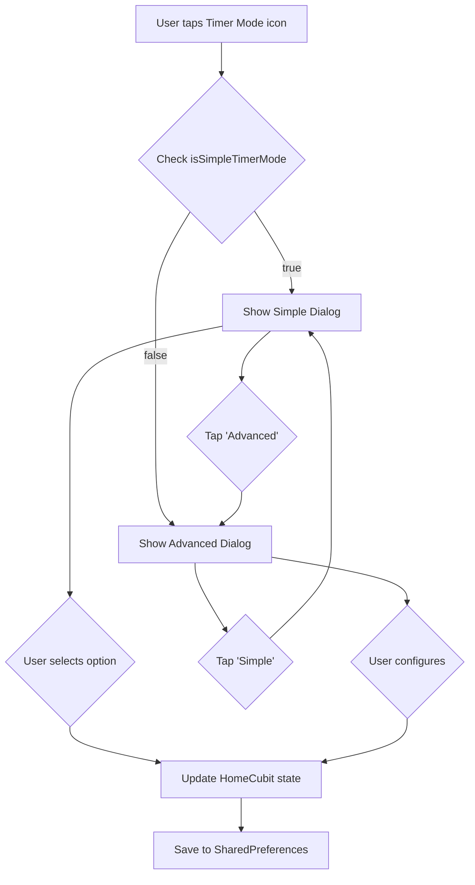

# Kế hoạch Thiết kế lại Timer Mode - Dual Mode (Simple & Advanced)

## 📋 Tổng quan

Thiết kế lại giao diện Timer Mode với 2 chế độ:
- **Simple Mode**: Giao diện đơn giản với 2 lựa chọn cơ bản
- **Advanced Mode**: Giao diện đầy đủ với tất cả tùy chọn hiện tại

## 🎯 Mục tiêu

1. Tạo giao diện Simple Mode giống ảnh thiết kế
2. Giữ nguyên Advanced Mode với tất cả tính năng hiện tại
3. Việt hóa 100% text trong Timer Mode
4. Cho phép chuyển đổi dễ dàng giữa 2 chế độ

## 📐 Phân tích thiết kế từ ảnh

### Simple Mode Dialog
```
┌─────────────────────────────────┐
│         Timer Mode              │
├─────────────────────────────────┤
│                                 │
│ ○ 25:00 → 00:00                │
│   Đếm ngược từ 25 phút cho đến │
│   khi hết thời gian            │
│                                 │
│ ○ 00:00 → ∞                    │
│   Bắt đầu đếm từ 0 cho đến khi │
│   dừng thủ công                │
│                                 │
├─────────────────────────────────┤
│    [Cancel]        [OK]         │
└─────────────────────────────────┘
```

### Advanced Mode Dialog (hiện tại)
- Dropdown chọn mode (Pomodoro/Đếm ngược vô tận/Tùy chỉnh)
- Input thời gian làm việc
- Input thời gian nghỉ
- Input số phiên
- Checkbox âm thanh
- Dropdown loại âm thanh
- Checkbox tự động chuyển phiên
- Nút chuyển sang Simple Mode

## 🗂️ Cấu trúc File

### File mới cần tạo
1. [`lib/features/home/presentation/widgets/timer_mode_simple_dialog.dart`](lib/features/home/presentation/widgets/timer_mode_simple_dialog.dart)
   - Widget cho Simple Mode dialog
   - Radio buttons cho 2 lựa chọn
   - UI giống ảnh thiết kế

2. [`lib/features/home/presentation/widgets/timer_mode_advanced_dialog.dart`](lib/features/home/presentation/widgets/timer_mode_advanced_dialog.dart)
   - Tách logic Advanced Mode từ [`timer_mode_menu.dart`](lib/features/home/presentation/timer_mode_menu.dart:15)
   - Tất cả tùy chọn hiện tại

### File cần cập nhật
1. [`lib/features/home/presentation/timer_mode_menu.dart`](lib/features/home/presentation/timer_mode_menu.dart:15)
   - Thêm state để track Simple/Advanced mode
   - Logic mở dialog tương ứng

2. [`lib/core/constants/strings.dart`](lib/core/constants/strings.dart:1)
   - Thêm constants cho text tiếng Việt mới

3. [`lib/features/home/domain/home_state.dart`](lib/features/home/domain/home_state.dart:1)
   - Có thể thêm field `isSimpleTimerMode` để lưu preference

## 📝 Chi tiết Implementation

### 1. Constants tiếng Việt mới

Thêm vào [`strings.dart`](lib/core/constants/strings.dart:1):

```dart
// Simple Mode
static const String simpleMode = 'Chế độ đơn giản';
static const String advancedMode = 'Chế độ nâng cao';
static const String switchToAdvanced = 'Chuyển sang nâng cao';
static const String switchToSimple = 'Chuyển sang đơn giản';

// Timer Mode Options
static const String timerModeCountdownTitle = '25:00 → 00:00';
static const String timerModeCountdownDesc = 'Đếm ngược từ 25 phút cho đến khi hết thời gian';
static const String timerModeCountUpTitle = '00:00 → ∞';
static const String timerModeCountUpDesc = 'Bắt đầu đếm từ 0 cho đến khi dừng thủ công';

// Dialog titles
static const String timerModeDialogTitle = 'Chế độ đồng hồ';
```

### 2. Simple Mode Dialog Design

**Đặc điểm UI:**
- Background trắng/tối tùy theme
- Radio buttons với description
- Typography rõ ràng, dễ đọc
- Spacing hợp lý giữa các option
- Nút Cancel & OK ở dưới
- Icon link/text để chuyển sang Advanced

**Component Structure:**
```dart
TimerModeSimpleDialog
├── Dialog Container
│   ├── Header (Title + Close button)
│   ├── Content
│   │   ├── Radio Option 1 (25:00 → 00:00)
│   │   │   ├── Radio Button
│   │   │   ├── Title
│   │   │   └── Description
│   │   └── Radio Option 2 (00:00 → ∞)
│   │       ├── Radio Button
│   │       ├── Title
│   │       └── Description
│   ├── Switch to Advanced link
│   └── Footer (Cancel & OK buttons)
```

### 3. Advanced Mode Dialog Design

**Giữ nguyên tính năng hiện tại:**
- Dropdown chọn mode (3 options)
- Custom work/break duration (nếu chọn Tùy chỉnh)
- Số phiên Pomodoro
- Checkbox âm thanh + dropdown loại âm
- Checkbox auto-switch
- Link chuyển về Simple Mode

### 4. State Management

**Thêm vào [`HomeState`](lib/features/home/domain/home_state.dart:3):**
```dart
final bool isSimpleTimerMode; // true = Simple, false = Advanced
```

**Thêm vào [`HomeCubit`](lib/features/home/domain/home_cubit.dart:54):**
```dart
void toggleTimerModeView(bool isSimple) async {
  emit(state.copyWith(isSimpleTimerMode: isSimple));
  final prefs = await SharedPreferences.getInstance();
  await prefs.setBool('isSimpleTimerMode', isSimple);
}
```

### 5. Logic chuyển đổi

**Trong [`timer_mode_menu.dart`](lib/features/home/presentation/timer_mode_menu.dart:15):**

```dart
void _showTimerModeMenu(BuildContext context) {
  final homeState = context.read<HomeCubit>().state;
  
  if (homeState.isSimpleTimerMode ?? true) {
    _showSimpleDialog(context);
  } else {
    _showAdvancedDialog(context);
  }
}

void _showSimpleDialog(BuildContext context) {
  showDialog(
    context: context,
    builder: (context) => TimerModeSimpleDialog(
      onSwitchToAdvanced: () {
        Navigator.pop(context);
        _showAdvancedDialog(context);
      },
    ),
  );
}

void _showAdvancedDialog(BuildContext context) {
  showDialog(
    context: context,
    builder: (context) => TimerModeAdvancedDialog(
      onSwitchToSimple: () {
        Navigator.pop(context);
        _showSimpleDialog(context);
      },
    ),
  );
}
```

## 🎨 UI/UX Guidelines

### Colors & Styling
- Sử dụng theme colors từ [`AppColors`](lib/core/constants/colors.dart)
- Radio buttons: secondary color khi selected
- Text: 
  - Title: FontWeight.w600, size 16
  - Description: FontWeight.w400, size 14, opacity 0.7
- Spacing: 16px giữa các option
- Border radius: 12px cho dialog

### Animations
- Fade transition khi mở dialog (300ms)
- Scale animation nhẹ (0.95 → 1.0)
- Smooth transition khi switch giữa modes

### Accessibility
- Tap area đủ lớn cho radio options (min 48x48)
- Contrast ratio đạt WCAG AA
- Screen reader support cho descriptions

## 🔄 Data Flow



## ✅ Acceptance Criteria

### Simple Mode
- [ ] Hiển thị đúng 2 option như ảnh thiết kế
- [ ] Radio button hoạt động chính xác
- [ ] Description text rõ ràng, dễ hiểu
- [ ] Nút Cancel & OK hoạt động đúng
- [ ] Link chuyển sang Advanced mode
- [ ] Toàn bộ text tiếng Việt

### Advanced Mode  
- [ ] Giữ nguyên tất cả tính năng hiện tại
- [ ] Link chuyển về Simple mode
- [ ] Toàn bộ text tiếng Việt
- [ ] UI/UX cải thiện hơn (nếu cần)

### Integration
- [ ] Lưu preference Simple/Advanced
- [ ] Khôi phục đúng mode khi mở lại
- [ ] Không ảnh hưởng logic timer hiện tại
- [ ] Tương thích với cả dark & light theme

### Testing
- [ ] Test chuyển đổi giữa 2 modes
- [ ] Test lưu và restore preferences
- [ ] Test với timer đang chạy/dừng/pause
- [ ] Test trên các screen sizes khác nhau

## 📦 Implementation Steps

1. **Tạo constants tiếng Việt** ✅
   - Cập nhật [`strings.dart`](lib/core/constants/strings.dart:1)

2. **Tạo Simple Mode Dialog**
   - Widget mới [`timer_mode_simple_dialog.dart`](lib/features/home/presentation/widgets/timer_mode_simple_dialog.dart)
   - UI theo ảnh thiết kế
   - 2 radio options

3. **Tạo Advanced Mode Dialog**
   - Tách từ [`timer_mode_menu.dart`](lib/features/home/presentation/timer_mode_menu.dart:15)
   - Widget mới [`timer_mode_advanced_dialog.dart`](lib/features/home/presentation/widgets/timer_mode_advanced_dialog.dart)

4. **Cập nhật State Management**
   - Thêm `isSimpleTimerMode` vào [`HomeState`](lib/features/home/domain/home_state.dart:3)
   - Thêm methods vào [`HomeCubit`](lib/features/home/domain/home_cubit.dart:54)

5. **Implement chuyển đổi mode**
   - Cập nhật [`timer_mode_menu.dart`](lib/features/home/presentation/timer_mode_menu.dart:15)
   - Logic routing đến đúng dialog

6. **Việt hóa hoàn toàn**
   - Review tất cả text
   - Thay thế hardcoded strings

7. **Testing & Polish**
   - Test flows
   - Điều chỉnh UI/UX
   - Fix bugs

## 🚀 Ready for Implementation

Kế hoạch đã sẵn sàng để chuyển sang Code mode để implement!